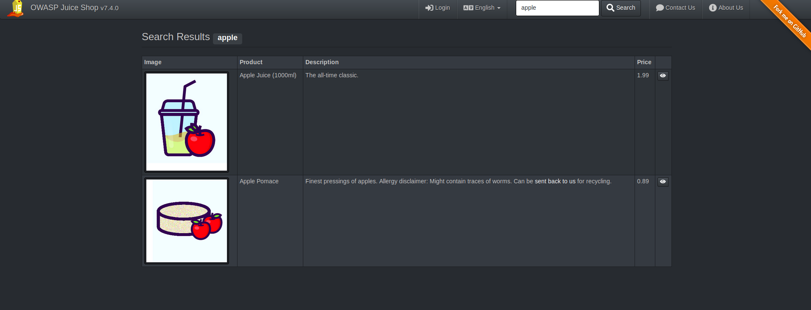

# SQL injection and basic SQL syntax. An example

## Overview

"A SQL injection attack consists of insertion or "injection" of a SQL query via the input data from the client to the application. A successful SQL injection exploit can read sensitive data from the database, modify database data (Insert/Update/Delete), execute administration operations on the database (such as shutdown the DBMS), recover the content of a given file present on the DBMS file system and in some cases issue commands to the operating system. SQL injection attacks are a type of injection attack, in which SQL commands are injected into data-plane input in order to effect the execution of predefined SQL commands." Taken from [OWASP](https://www.owasp.org/index.php/SQL_Injection)  

## Example

### Scenario

Lets fo over the concept of SQL injection with a simple example. Lets use OWASP Juice shop as an demonstration tool. In Juice shop the system takes your input and shows results based on that. For example if I search for an apple it shows apple related results



How does the juice shop or a similar system turn your search result to products on the screen? Generally systems like this take the input and the backend (php-, python-, nodejs-server etc) uses it to generate a SQL-query which it sends to the SQL-server. From this the backend gets the product information and is then able to show the products on the screen. The SQL-query is generally something like this:

```sql
SELECT * FROM table_name WHERE condition LIKE '%user_input%'
```
This is obviously a very simplified query and the query can be done in many ways. For example when you start SQL-injecting the Juice shop you realize the that query is bit more complex


### SQL syntax
Lets go over what this query does. SELECT is an SQL-command that selects a column from a table. In this case the 

```sql
SELECT column_name FROM table_name
```

selects the column "column_name" from table "table_name". If you wanted to select multiple columns you could change the "column_name" to "column_1, column_2..." or if you want to select all the columns you can use the *-symbol.

Command WHERE is used to filter results to what is specified in the "condition" variable. This "condition" variable could be many things. It could for example limit the results only to results that has a specific value in a specific column. For example: 

```sql
SELECT * FROM Students WHERE Course="Compsec"

```
would go over all columns from tabel Students and return the ones whos column named "Course" contains the word "Compsec".


 LIKE command is used to limit the search for results that contain a specific pattern. In this case the word "user_input". The %-signs over the result are wild cards that mean that the results should match one or more characters of the specified string. For example

 ```sql
SELECT * FROM Students WHERE Course LIKE '%Compsec%'
 ```
would do the same as the above mentioned example. 

### Injection

No that we understand what the example query does we can go over the idea behind SQL injection. Like discussed earlier we can only change the "user_input" part of the query. How could this be an issue? And how can this be abused? Lets change the "user_input" to "'user_input". 

```sql
Original
SELECT * FROM table_name WHERE condition LIKE '%user_input%'
Modified
SELECT * FROM table_name WHERE condition LIKE '%'user_input%'
```
Like you see the formatting breaks. There are too many brackets and a query like this should cause a SQL-error if you input it to the Juice Shop.

This way we can "escape the bracket" so to speak and this way start adding to the previous query. However this is pointless if we keep getting errors due to broken syntax caused by any code left after the user_input part. A way around this is to use SQLs comment symbol "--". With this be can wipe out everything after our injected command. for example if we send 'INJECTION--

 ```sql
Original
SELECT * FROM table_name WHERE condition LIKE '%user_input%'
Modified
SELECT * FROM table_name WHERE condition LIKE '%'INJECTION--'
```
The "--" symbols make everything after them into a comment. Now we are free to change the INJECTION part in to some type of SQL command that can have malicious implications. 

### UNION

UNION-command combines result sets of multiple SQL SELECT commands. Example below

```sql
UNION example
SELECT * FROM table_name WHERE condition LIKE '%user_input%'
UNION
SELECT * FROM table_name2 WHERE condition LIKE '%anything%'
```

This example returns the results of both SELECT commands. There are few requirements however:

* Each SELECT statement within UNION must have the same number of columns

* The columns must also have similar data types

* The columns in each SELECT statement must also be in the same order

These requirements make utilizing UNION in SQL injection harder. It is unlikely that the attacker knows the exact structure of the SQL tables so forming an UNION command that returns something it shouldn't can require some educated guesswork. In the exercise you will see that the server returns error messages that you can use to guess the tarble structures.


### References
https://www.w3schools.com/sql/sql_injection.asp

https://www.owasp.org/index.php/SQL_Injection

https://www.tutorialspoint.com/sql/sql-wildcards.htm

https://www.w3schools.com/sql/

https://www.w3schools.com/sql/sql_union.asp
