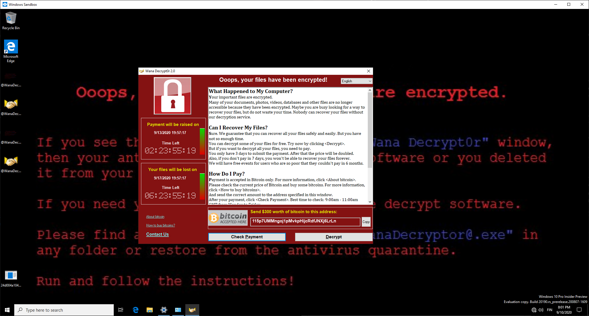

Computer Security Lab 3: From innocent document file into part of botnet 
====


## Preliminary tasks

Before the lab, it's good to verify that [cincan-command](https://gitlab.com/CinCan/cincan-command) is working on your machine. Installation steps can be found from [here.](https://cincan.gitlab.io/cincan-command/installation.html) It is pre-installed into the provided Kali Linux.


It is recommended to read at least following articles in some level to get familiar about topic.

### For the first and second task

What are [macros in Office documents, why they could pose a thread?](https://docs.microsoft.com/en-us/windows/security/threat-protection/intelligence/macro-malware)

How about [PDF files?](https://www.decalage.info/file_formats_security/pdf)

Take a look for [SANS DFIR short guide](https://sansorg.egnyte.com/dl/IQ3GhaH868/) for analysing malicious documents. We are using some of the tools.

Further reading about malicious PDF and Office malware is [available in here.](https://www.tandfonline.com/doi/full/10.1080/19393555.2020.1723747?scroll=top&needAccess=true) It is long but quite all-answering. (Available in the University Network (can be accessed [via VPN](https://www.oulu.fi/ict/openvpn) or SSH tunneling.)


Even more reading (optional), slides from the author of most the macro based tools what we are using, available in [here.](https://www.decalage.info/files/eu-19-Lagadec-Advanced-VBA-Macros-Attack-And-Defence.pdf)


### For third task these could give some insight about the purpose of the executable

[What is a DDoS attack?](https://www.cloudflare.com/learning/ddos/what-is-a-ddos-attack/)

[Botnets?](https://www.cloudflare.com/learning/ddos/what-is-a-ddos-botnet/)

We will be de-compiling .NET Framework project executable to see how malware works on source code (C#) level. So, some source code reading ahead!

### For the last task:

Blog post about malware analysis [in here.](https://medium.com/@dunstconsulting/the-different-types-of-malware-analysis-c9bfbaa44739)

[What is sandbox?](https://www.quora.com/In-computer-security-what-is-a-sandbox)

If you are not familiar with Wireshark, take brief look in to it. [Here is short tutorial.](https://www.lifewire.com/wireshark-tutorial-4143298)

About memory analysis with Volatility: [here](https://medium.com/@zemelusa/first-steps-to-volatile-memory-analysis-dcbd4d2d56a1) is some good blog post about it. This is automated in the task, but volatility can be used externally as well for taken memory dump. 

## Background

Malicious programs are a potential harm for almost every user in the internet. In last year, one was especially causing gray hairs for plenty of people; *Emotet* malware.  Finnish National Cyber Security Centre (NCSC-FI)  released (8/2020)  [yellow level of warning](https://www.kyberturvallisuuskeskus.fi/en/emotet-malware-actively-spread-finland) about malware; how big is the risk for facing this malware to be at the moment on organizations. Maybe COVID-19 pandemic made botnet operators to give up on their vacation, and they are pushing new variations of the old malware. 

There are many ways for malware to spread. This one is using as one, old but still working tactic where user is involved: email attachments. Innocent looking attachment in the innocent looking email message could contain something what you did not except. The content of the attachment is usually made to be something, what you might be more compelling to open: invoices, receipts, legal documents, and more. *In 2017, according to Cisco, 38% of malicious file distributors belonged to Office Suite file extensions and 14% containing PDF extension. [[1]](https://www.tandfonline.com/doi/full/10.1080/19393555.2020.1723747?scroll=top&needAccess=true).*

*Emotet* is currently known mostly as *information stealer*. It is [RAT](https://www.howtogeek.com/410634/what-is-rat-malware-and-why-is-it-so-dangerous/) (Remote Access Trojan) on the computer, and is able to receive almost arbitrary commands for making actions for infected computer.

This exercise is mostly based on something similar. Malicious document file is doing something more in your computer than you thought! *However, files here are not dangerous, but they can be flagged by some anti-virus products. It is recommended to handle them in Linux based operating system!* **With one exception; the malware of the final task (WannaCry) is ransomware and it should not be executed on Windows machine! Even better, don't get it into your Windows host machine.**

In the first task, we try to identify whether PDF of Office document file is clean or malicious, and further try to analyze what suspicious they are doing.

In the second task, we will take a look for *.eml* file (Saved email message), and try to analyze its attachment(s). How far we can go?

In the third task, we are analysing something that attachment in the previous task attempts to download and install. This executable was part of the real-life incident, which was used to deploy botnet network for performing DDoS attack against official Finnish government websites and other targets. Malware was originally distributed as trojan horse, a Steam Code Generation application which was supposed to give you free steam codes. (What it of course did not do)

In the last task of the exercise, there is possibility to analyze another common malware, *WannaCry* which is infamous ransomware and caused some chaos some years ago. It had worm-like properties by exploiting some vulnerabilities and spreading mostly without user involvement.

(Part of this real-life DDoS incident can be seen in the Lab 6 (Digital Forensics) as well, in [Task 3](../Lab6_Digital_Forensics/README.md#Task-3). In that exercise you can see what kind of traces DDoS attack can leave in log files. You will learn  how to analyze large-sized log file, and made precises analysis from it. )

---
Grading
---
Make a short step-by-step report (what, why and how) of following tasks, and include possible source codes and the most important command line commands used in those tasks. It's recommended to read all tasks before starting. Actual instruction for what to do, is ***in bold and italics*** on each task.

You are eligible to following grades in this exercise by doing tasks as defined. Great ideas and implementations could compensate some poorly implemented ones.
*Upper grade requires that all previous tasks have been done as well.*

It is estimated, that you are able to do Task 1 and 2 during lab session (4 hours).

Tasks 3 & 4 are more advanced or time consuming than earlier ones. Implementation will very likely take time outside of lab.

Task|Grade/Level|Description|
----|:---:|-----------|
[Task 1](#task-1--identifying-malicious-documents "Identifying malicious documents") | 1 | Identifying malicious documents
[Task 2](#task-2-malware---static-analysis "Deeper analysis of the MS Office Document") | 2-3 | Deeper analysis of Office Document
[Task 3](#task-3-static-analysis-of-trojan "Static analysis of trojan") | 4 | Static analysis of trojan
[Task 4](#task-4 "Dynamic & static analysis for more complicated sample ") | 5 | Dynamic & static analysis for more complicated sample

Grade 1 can be acquired by doing the first task.

Grade 2 and 3 can be acquired by doing Task 2, depending on how far you go.

Difficulty or workload on tasks is expected to be raising as you go forward with them.

You should read all of the instructions, that you know what is happening, and what you actually have to do.

*Return completed tasks to your private GitHub repository!
There will be answer template.*

---


## **Task 1: Identifying malicious documents**

We have a bunch of document files, whereas some of them might be something more than just documents. Without opening them (hopefully), could we identify the malicious ones from the clean ones?

One great paper about PDF and Office malware on general level is [available in here.](https://www.tandfonline.com/doi/full/10.1080/19393555.2020.1723747?scroll=top&needAccess=true)
Only available in the University Network (can be accessed [via VPN](https://www.oulu.fi/ict/openvpn) or SSH tunnel).

There are various amount of tools for doing analysis partially for you, and we are going to try out some them.

Document files can be found from the zip file in [misc/malware](misc/malware) named **maldocs_task1.zip**. Password is *infected*

**WARNING:** Do not extract the zip files directly in Windows machine. Antivirus might flag and remove them, even though there are not really malicious files. They just look like and include some patterns malicious files could have.

**A) Has it been identified already?**

When we face a suspicious file, what could we do at first? The first thing we can do, is to see *if someone has already wondered the same thing and has done the analysis already!*

Many anti-virus tools and other databases are signature based - they might have exact [signature hash](https://medium.com/@tom_rock/fifty-shades-of-malware-hashing-3783d98df59c) or some other regular pattern database for detecting malware. Someone/something might have submitted the file into these places and classified it already.

Some tools/utilities for general analysis; does it exist already?

 * [ClamAV](https://www.clamav.net/) - The biggest Open Source antivirus engine
 * [VirusTotal](https://www.virustotal.com/gui/) - analyze url, file or search by hashes against many AV engines. CLI is available in [here.](https://github.com/VirusTotal/vt-cli)
 * [Yara](https://github.com/VirusTotal/yara) - known as the pattern matching swiss knife. Part of VirusTotal, but can be used as CLI or as Python library for example. Powered by list of rules. 
 * [Windows Defender](https://docs.microsoft.com/en-us/windows/security/threat-protection/microsoft-defender-antivirus/microsoft-defender-antivirus-in-windows-10) - many times underrated - but has possibly the largest signature and pattern based database among all Windows running anti-virus engines. Not used here in practice- but should be noted as good one because of that. (Even [scary good at collecting samples](https://medium.com/sensorfu/how-my-application-ran-away-and-called-home-from-redmond-de7af081100d))

We could try to use ClamAV:

```console
clamscan <FILENAME>
```

Or with [cincan-command](https://gitlab.com/CinCan/cincan-command):

```console
cincan run cincan/clamav <FILENAME>
```
This will scan the file against ClamAV:s current database.

Similar example with yara:

```console
cincan run cincan/yara -w  "/rules/index.yar" <FILE>
```
To search with all pre-defined rules of yara. (See package in [here.](https://gitlab.com/CinCan/tools/-/tree/master/stable/yara))


We could also try to use VirusTotal for seeing if there is already report about some of our file(s). We could use the graphical Web interface or CLI tool for that. 

*In the case of CLI tool, we should calculate the hash (SHA256) of the file and search based on that at first - in general, uploading is quite permanent thing and then the file is identified by everyone.*
By searching with file hash, we can see if the file has been already submitted in there.

`sha256sum` command can be used for calculating SHA256 hash of the file.

By using `vt-cli`, we can search for example matches by:
```console
vt -k <APIKEY> file <FILEHASH>
# Or with cincan-command
cincan run cincan/virustotal -k <APIKEY> file <FILEHASH>
```

If you don't want to create account for VirusTotal, you can use following API key: *cc36b7771c0c738d7923b3209b6ae6c37a868e9412b3c2dd4109b10bda8f4f6e*. Key is required for CLI, but single key can make only 4 requests per one minute.

**Do we find some malicious files based on these? Even if there are malicious files, why might not they appear there? What is the bad thing on signature based identification?**

B) **What is the worst thing you can do with suspicious Microsoft Office document? (Disabled by default)**

C) **Malicious PDF files are also common. How are they usually infecting the machine of the potential victim?**

D) Let's take a deeper look

Some tools for analysing PDF files are listed below. They attempt to identify some known patters, which usually can be seen in malicious file, and rarely in the clean files. They are easiest to use with `cincan-command` but you can install them by yourself. They are also as normal packages in Kali.

 * [pdfid](https://blog.didierstevens.com/programs/pdf-tools)
 * [pdf-parser](https://blog.didierstevens.com/programs/pdf-tools/)

At first, ideally we want to find some suspicious keywords from PDFs such as `/JavaScript`, `/OpenAction`, `/GoTo`, `/URI` and `/RichMedia`,. PDF format is based on specific structure with possible keyword elements.

Pdf-parser and pdfid are capable for doing that. See `--help` of each tool for creating correct command. Pdf-parser can print each section of the PDF file.

E.g. pdfid is simple to use at basic level:
```console
cincan run cincan/pdfid <FILENAME>
```
One of the PDF files is 'malicious'. What it attempts to do, is not working in the most PDF readers anymore.


Tools for analysing Microsoft Office documents (OLE2 format, called also as [Compound File Binary Format](https://en.wikipedia.org/wiki/Compound_File_Binary_Format)) are listed below. Usually these files ends with the file extensions '.doc' or '.xls'

 * [oletools](https://github.com/decalage2/oletools) (set of different tools)
 * [oledump](https://blog.didierstevens.com/programs/oledump-py/)

 For example, the tool `olevba` from oletools can be used for analysing VBA macros from the document, and detecting some suspicious keywords:

```console
cincan run cincan/oletools olevba <FILENAME>
.
.
.
.
+----------+--------------------+---------------------------------------------+
|Type      |Keyword             |Description                                  |
+----------+--------------------+---------------------------------------------+
|AutoExec  |AutoOpen            |Runs when the Word document is opened        |
|Suspicious|powershell          |May run PowerShell commands                  |
|Suspicious|EncodedCommand      |May run PowerShell commands                  |
|Suspicious|Base64 Strings      |Base64-encoded strings were detected, may be |
|          |                    |used to obfuscate strings (option --decode to|
|          |                    |see all)                                     |
|IOC       |calc.exe            |Executable file name                         |
|IOC       |wonderful.ps1       |Executable file name                         |
+----------+--------------------+---------------------------------------------+
```

One of the `.doc` files is 'malicious'.


**Which files might seem to do something abnormal? What they attempt to do in general level? Are they executing some code? Include code. Include also the suspicious keywords of PDF.**

It should be noted, that these are not sophisticated malware, just demonstrating basic actions; you can never fully trust the tools.

## **Task 2: Deeper analysis of the MS Office Document**

You work at the very big company as Security Analyst. Someone has sent a suspicious email message for the Chief IT in charge, and she wants the message analysed by you. She saved the message and delivered that in `.eml` format for you.

File can be found from [here.](misc/malware/Your_great_reward_is_here.eml)

Saved email messages are based on [RFC 822 standard](https://www.ietf.org/rfc/rfc0822.txt) in most of the cases. For example  Thunderbird, Outlook and Gmail exports in this format by default, when you want to save a single message. 
Could we parse the file and see the content without using these clients?
Could we get potential attachments as well?

One possible way is by using [eml_parser](https://github.com/GOVCERT-LU/eml_parser) Python library. Simple client is packaged by [`CinCan`](https://gitlab.com/CinCan/tools/-/tree/master/stable/eml_parser) and can be used with `cincan-command`.

```console
cincan run cincan/eml_parser --help
```

It has only one optional argument, but it does the work.

This suspicious email has archived document file as attachment - once it has been acquired, we can start analysing it like in the previous task with the same tools.

**How does it look like? Marcros again, are they executed automatically?**

At first, you can take a look for the document with the tools from the previous task. 

However, in this case the macro in the document is [*obfuscated*](https://en.wikipedia.org/wiki/Obfuscation_(software)), and by looking the source, functionality might be hard to understand. Luckily for us, obfuscation is implemented a bit poorly, and we could use specific tool for emulating the execution of the macro, and see at some level what it is doing!

This tool, called [vipermonkey](https://github.com/decalage2/ViperMonkey) is designed to analyze and deobfuscate malicious VBA Macros contained in Microsoft Office files. It attempts to run macro to see interesting commands and their possible arguments. Tool is not perfect, but it works for most of the documents, and in this case.

You can also use it with `cincan-command`:

```console
cincan run cincan/vipermonkey <ARGS>
```

Emulation might be slow, depending on your computer. Using JIT compilation (`--jit` option) might speed up a little.


Vipermonkey **is not** revealing one file write operation action, which is related for acquiring embedded data from the `.doc` file. 
Can you guess it from the macro source code?
*The macro in this case drops embedded executable file and runs it.*

With `oledump`, try to compare sizes and contents of different sections of the file, if there are something strange, particularly in the summary sections. With `oledump`, you can also view/dump contents from different sections.
Vipermonkey finds this same data as potential IOCs; we just don't know what that is, from where it is coming from and what is the purpose.

**What shell commands macro was executing? Could you shortly describe the idea of carrying the malware and commands? Can we acquire this dropped executable from the document file?**

There are a lot of encoded strings, and command line tool `base64` could be useful. Also, if output is odd, you can use `file` command to see guessed filetype.

Once we get our hands in this executable, we can go even further. `file` command might tell the type of the executable, and in this case it is unprotected .NET assembly.

Because of the way of how .NET assemblies are created, they can be reversed back into readable source code, if some extra protection is not applied. And we are about to do that; tool named [ILSpy](https://github.com/icsharpcode/ILSpy) is capable for reversing .NET assemblies. You can install it by yourself or use with cincan-command:

```console
cincan run cincan/ilspy <ARGS>
```

**What is this executable doing? How it is trying to persist in the system? Is it dropping even more files?**

It is getting at least one file over the internet, and that is protected somehow. Command line client of `openssl` could be useful here for decrypting it, binary contains required information for doing that.

**Figuring out the functionality of this file is left for the next task.**

## **Task 3: Static analysis of trojan**

In the previous task, we took first steps for binary reverse engineering. The binary was created with **C#** as .NET project.

In this task, we are going to figure out what file [boom.ecrypted](misc/malware/boom.encrypted) is actually doing. Based on the previous task, we have enough information to decrypt the file, and get the original binary file. This task is going little further with binary reversing.


Let's see what basic Linux command *file* has to say about this one:

```console
$ file boom.exe
boom.exe: PE32 executable (GUI) Intel 80386 Mono/.Net assembly, for MS Windows
```

Looks like that we are probably facing .NET assembly again.

We can still use previously mentioned [ILSpy](https://github.com/icsharpcode/ILSpy).  Other similar tool, [dnSpy](https://github.com/0xd4d/dnSpy) is great for GUI based usage, when Windows machine is available.

When using `ILSpy`, pay attention for the tool parameters. The one about whole project decompilation is really useful in this case. Decompilation might take some time. Files are not protected at all.

Tool can be used with `cincan-command`:
```console
cincan run cincan/ilspy <ARGS> <FILE>
```

This malware was written in Visual Basic (we can see the code as C#) and looks like it has been Microsoft Visual Studio project.

**Now, the intention of this task is to write short report what program is actually doing.** 

Since we can read program mostly in C#, it shouldn't be that hard at all. (In the most cases malware is written in C language or protected somehow, and on those cases we might need to read pure machine instructions instead.)

You are free to use any tools you want, as long as you are not making analysis in your host system in unsafe environment. Even though this malware is not dangerous anymore, it's good to have principles, and it leaves some files on your machine anyway.

**TIP:** In case .resource files (binary type) are provided instead of .resx format, you can convert it into .resx format from command line as:
  
`resgen Resource.resource Resource.resx` (you might need to install `mono-complete` package (Debian) for that)

[.Resx files?](https://docs.microsoft.com/en-us/previous-versions/visualstudio/visual-studio-2008/ekyft91f(v=vs.90))

If you have up-to-date Windows 10 machine with Pro, Enterprise or Education licence, you can use [Windows Sandbox](https://docs.microsoft.com/en-us/windows/security/threat-protection/windows-sandbox/windows-sandbox-overview) for executing the files, if you want to, particularly for seeing the hidden GUI. Other way is to use [Windows Test image](https://developer.microsoft.com/en-us/microsoft-edge/tools/vms/) on VMware or other virtualization solution.


>**Answer *at least* to these questions in your report (they might differ from your template, use these on confusion):**
* What was the connected domain? What it did at first with it? Did it enable something that further steps succeed?
* This file contains actually two additional binaries. (These files have been encoded to .resx file somehow) What are their names? What it does with them?
* **Find a way** to reverse these files as well, and include the general purposes of these files as well to your report. Additionally:
  * How bots were controlled? There were at least two ways, describe at least the automatic approach.
  * Some source code or ideas of some common DDoS tools have been used in this malware. Describe three of them. It's enough to identify tools, you can look information about them elsewhere.
  * Malware actually contains hidden GUI for DDoS tools it is using. Can you find and use it? Describe how you did/could do it.


## Task 4: Dynamic &|| static analysis for more complicated sample
You have an option to do pre-defined task below or suggest some other task you would do. **Something interesting** in botnets or malware, but we haven't dealt with it yet? Feel free to implement and show us what you got. **Your task has to be approved by assistant before you can start doing it.**

## WannaCry - pre-defined task

One of the required skills of analyst or digital forensics guy is to get your analysis environment up and running. Sometimes this might take more time than analysis itself.

Ever heard about WannaCry malware? Four years ago (2017), this malware caused a lot of troubles in hospitals and other organisations. 




This malware was ransomware attack, and encrypted all the of important files of the machine. It exploited some vulneralibities, which gave it self-spreading properties, making it a *worm*. Luckily there was a flaw (or intended property), which was so called *kill switch*, and stopped the spreading of malware in the cases, when machine was able to connect internet. Every time when malware was executed, it looked for some domain. Based on the result malware did something. 
**In this task, we will take of look for original [*dropper*](https://en.wikipedia.org/wiki/Dropper_(malware)) of WannaCry. Only this specific dropper contained so called kill-switch.**

What we want to do at first, is to make *dynamic analysis for it.* It means, and we are executing the malware, and see what actually happens. 

When you want to analyze malware, you don't usually want to infect your own machine. Instead you want to run it in some safe environment. Additionally easy way to undo changes would be helpful if you want to repeat the process somewhat easily.

Virtual machines are one good solution. Snapshot feature allows easy way to roll back into the situation, where you were before the moment of execution. Modern malware might even detect virtual environments, and therefore hiding their malicious activities, but we are ignoring it now.

We might have been using virtual machines already at this point, but now we are taking this a little further.

The malware is located in the `misc` folder, it is zipped twice and password is `infected`.

### The dynamic analysis

You have three options, and you have to mostly figure out things by yourself:

  * Make analysis by using F-Secure [SEE (Sandboxed Execution Environment)](https://github.com/F-Secure/see)
    * You have to setup environment by yourself. See [documentation](https://see.readthedocs.io/en/latest/) for steps.
    * Use Debian Stretch based Linux as installation system for SEE; it might save some hair
    * Sample Python code for making network analysis, memory dump and disk analysi is available in here: [misc/sandbox.py](misc/sandbox.py). Note, that you need to configure agents correctly corresponding the code.
    * Some tips are mentioned in [here.](see/README.md)
    * You can see example disk changes what WannaCry is causing in [here.](see/disklogs/WannaCry_example_diskchanges.json)

  * Make analysis with [Cuckoo Sandbox.](https://cuckoosandbox.org/) Setting up environment is not very straightforwad. Hard!
  * Not automated analysis (Using native Windows Sandbox or Windows in VirtualBox/VMware)
    * You have to capture network traffic manually and take memory dump by yourself
    * [Windows Sandbox](https://docs.microsoft.com/en-us/windows/security/threat-protection/windows-sandbox/windows-sandbox-overview) (Native on latest Windows 10 version: Pro, Enterprice or Education licence required)
        * You can quite safely drop files on there and execute them
 
    * Windows Test images are available in [here.](https://developer.microsoft.com/en-us/microsoft-edge/tools/vms/) Windows 7 is recommended as you can use volatility2. It works with `cincan-command` as well.
    * [Wireshark](https://1.eu.dl.wireshark.org/win64/) (Choose .exe file)
      * Capturing network traffic inside Sandbox or virtualized Windows. Depending on the host, might be done outside the sandbox as well by selecting correct adapter.
    * Acquiring memory dump inside from live system: [LiveKD](https://docs.microsoft.com/en-us/sysinternals/downloads/livekd) (` .\livekd64.exe -o memory.dmp`)
      * Note: You might need [volatility3](https://github.com/volatilityfoundation/volatility3) for analysing latest Windows 10 
    * On VirtualBox or VMware, taking a memory dump is easier. 


In case your Sandbox did not make analysis already, you can manually use [volatility2](https://github.com/volatilityfoundation/volatility) or [volatility3](https://github.com/volatilityfoundation/volatility3) for acquired memory dump; consult their documentation for making the analysis.


**In all of the cases, you are expected to acquire at least memory dump (and find mutexes) and capture network traffic (and find URL), and do simple static analysis afterwards!**

* **Malware makes single HTTP request when connection is available; capture it with Wireshark and show it. E.g. screenshot and packet data capture summary. When connection is not available, it encrypts the machine...** 
* **In memory analysis (you are excepted to do this, when connection is not available == it encrypts the machine), you can use plugin `mutantscan` of Volatility. What is mutex/mutant in malware analysis? What is the the mutex of this particular malware? In the best case, if you create same mutex before executing the malware, what would happen? Provide Volatility output file/screenshot.**
* Verify the URL - make simple static analysis:

  * You can use (and it is recommended to use) for example [radare2](https://github.com/radare/radare2) for reverse engineering this executable. In practice, we are disassembling binary to machine instructions, and looking the code of malware in assembly language. Radare2 will be used in future as well.

  * Cheatsheet for Radare2 can be found [here](https://github.com/radare/radare2/blob/master/doc/intro.md).

  * **Do you find the same URL than you captured with Wireshark? Which function calls it? What are the conditions/functionality of binary when calling the the URL and shortly after?**

**Make short report including sections above. Include, how you did the dynamic analysis/set up the environment and took the memory dump and captured the network traffic. You can do even more if you want...**

#### Extra
You can also try to use tool called [Minion](https://gitlab.com/CinCan/minion) with [these](https://github.com/ncsc-fi/minion-rules) rules to acquire a lot of information from the memory dump file. It requires working Docker and should be used on Linux machine.

##### For Windows Sandbox

* Additional utilities, maybe or maybe not useful
  * https://github.com/karkason/pywinsandbox 
  * https://github.com/microsoft/Windows-Sandbox-Utilities 


