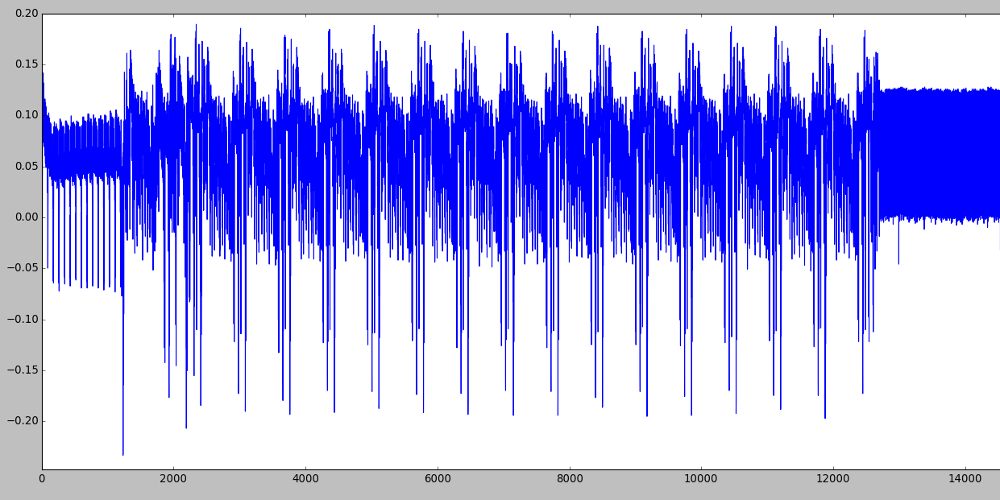
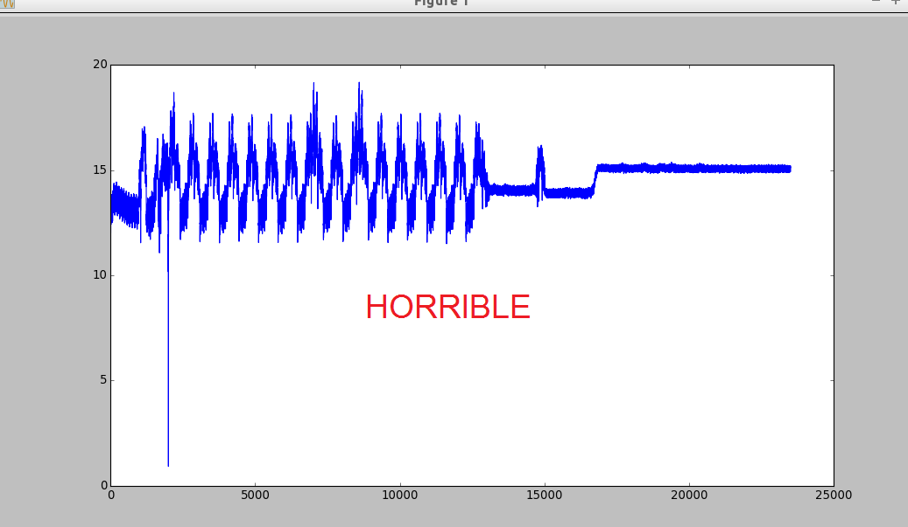
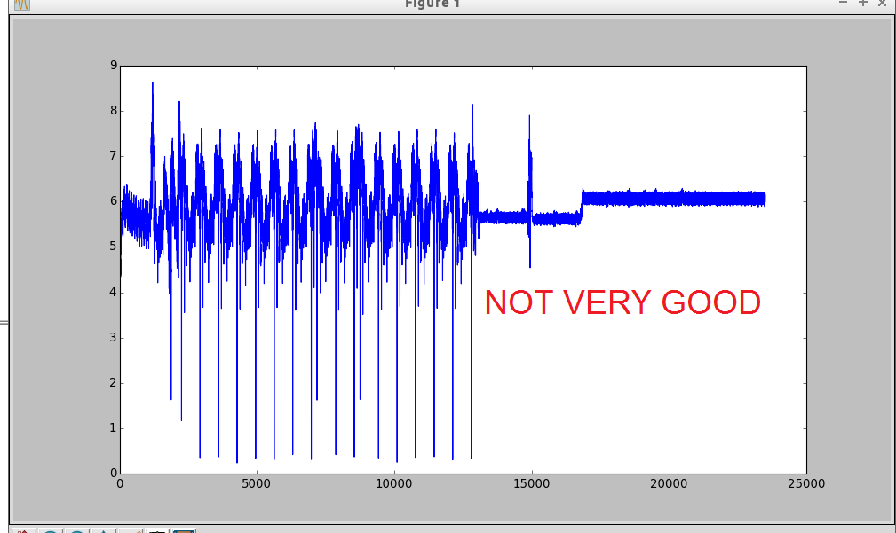
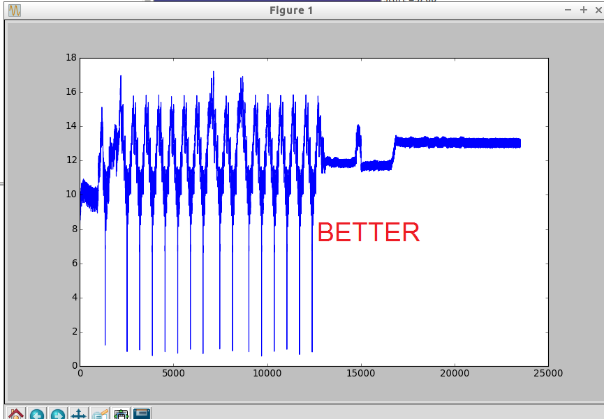

Computer Security Lab 5: ChipWhisperer
====

## ToC

* [Introduction]

    * [Practical arrangements of this lab]

    * [Background of power analysis]

    * [Grading]

* [Setting up]

    * [Hardware setup]

    * [Software setup]

* [Tasks]

  * [Task 1]

  * [Task 2]

  * [Task 3]

  * [Task 4]


# Introduction

This week’s theme is hardware security so also this lab considers hardware security by giving examples of side channel attacks. In this lab you will be using ChipWhisperer hardware and tools to perform side channel experiments.

[Chipshisperer](https://newae.com/tools/chipwhisperer/) is an open source toolchain dedicated to hardware security research. ChipWhisperer project intends to make easy start on hardware security experimenting for anybody who interested about it.

ChipWhisperer device consists of 2 parts:
* Capture board is specialized hardware which is able to capture traces from target
* Target board is just some kind of processor which is programmed to perform some kind of secure operation

Basic idea of this lab is simple: We have target device which runs secure operations and we want to reveal information about those operations by measuring and analysing power consumption of target device. 

This lab exercise intends to give examples of different ways to hack into hardware. There is no guarantee that exactly these hacking examples would be working or practical in real life situations, but main goal is to educate students about possibilities of hardware hacking.

This "Introduction" section contains background information about power analysis, information of practical arrangements of this lab and information about grading information of different tasks. Next "Setting up" section contains all instructions what you are required to do before you can start making tasks. Section "Tasks" contains all 4 tasks and instructions how to do them.

## Practical arrangements of this lab

This lab is little bit different than others because tasks require the usage of external device. Number of devices are limited, so it causes some difficulties to arragements.
* Students are encouraged/forced to do work in groups of 2-3 in lab sessions. Size of group heavily depends on how many students attend to lab sessions.
* Students are encouraged to borrow device do the lab ahead of schedule to balance load on actual lab week
* Students can borrow devices after/between lab sessions to continue working on tasks at home (alone, in same group or even with different people). In these cases pay close attention of **marking down clearly who participated on which tasks** because it is only way everybody can get the right amount of points when works are graded.
* We try to arrange loaning times so that everyone would have chance to hold device at least couple of days if they want.
* You may use ChipWhisperer device in your coursework, but notice that how long you can keep device yourself is heavily depending how much other people are wanting to borrow them. Discuss with course assistants as early as possible if you want to use ChipWhisperer in your coursework.

## Background of power analysis
Tänne yleistietoa power analysista, kirjoitettava uudelleen paremmin?

Power analysis is a branch of side channel attacks where power consumption data is used as the side channel to attack the system.

Basic idea of power analysis could be described next way:

Target device has secret information in its memory and we want to reveal it...

We know the source code of device and inputs and outputs, but secret information like encryption keys and passwords are used only in internal execution and those cannot be seen by outsider.

What can we do to reveal secrets? We could approach problem from software viewpoint and for example try to find bug in the source code and then exploit that by constructing malformed input which causes device to function unexpectedly. But this time we are not going to play by the ruleset that only software gives us.

Because we have access to hardware, we can utilize that in our attack. We can attach our measurement device to the target board and perform side-channel attack in the form of power analysis.

Idea of power analysis attack is simple. Every operation on target chip consumes different amount of energy and therefore it produces different power trace. Because we know what source code is, we know every possible operation that chip will perform and when it will perform it. We also can see from source code when the secret data affects execution and we can see the logic how secret data affects the execution and causes different energy consumption. By knowing all of that, we can deduce secret information that target contains by simply analyzing captured power traces from the device.

More information about principles of power analysis can be found from [Wikipedia](https://en.wikipedia.org/wiki/Power_analysis) and more ChipWhisperer-related information about CPA can be found from manufacturers [wiki](http://wiki.newae.com/Correlation_Power_Analysis)


## Grading

Task of this lab are divided to 4 different tasks which have corresponding grades in table below. Notice that *Good-to-have skills* are only directional descriptions about required skill levels.

Task| Grade/Level | Description | Good-to-have skills
--|:--:|--|--
1|2|Getting started with ChipWhisperer, inspecting power traces and breaking AES|Basic understanding of C and Assembly code, reading and understanding technical articles, basic understanding of statistics
2|3|Password bypass with timing attack and breaking RSA with power and timing analysis|Simple Python coding
3|4|Glitching|Slightly more complex Python coding
4|5|Several alternatives for advanced experimenting|Different advanced skills depending on your project

---

# Setting up

Due to external device and specialized software, this lab needs some extra work to set everything up.

## Hardware setup


Device package should contain next items
* ChipWhisperer Lite 1173 Main board
* CW303 XMEGA Target board
* Serial cable
* 2 SMA cables
* USB cable

Do next steps to prepare device for usage
* Connect serial cable to serial ports of main board and target board
* Connect SMA cable to measure ports of main board and target board
    * If you are doing glitching-related tasks, you must connect also glitch ports with second SMA cable
* Connect USB cable to main board

Ending result should look like next (if you do not need glitch ports)


Numbers in image are marking next ports:
1. Measure ports
2. Glitch ports
3. Serial cable ports
4. USB port

**NOTICE: Handle device with carefully. Static electricity might be harful to board. Some ports might be little tight, but device still should be able to be assembled without excessive usage of force.**

More detailed documentation of the device can be found from http://wiki.newae.com/CW1173_ChipWhisperer-Lite , but it should not be needed for basic tasks.

## Software setup

To connect and use ChipWhisperer device and analyze power traces, you need ChipWhisperer software installed on your machine. There is 3 different ways to do that, choose the one that suits you best.

* Option 1: We recommend that you use preconfigured virtual machine image (VMWare) of this laboratory exercise. It has everything installed and all scripts set ready. To get image, follow instuctions at xxx
* Option 2: If you do not want to use ready image or can not use WMWare images, you may download clean image from manufacturer [by following these instructions](https://wiki.newae.com/Installing_ChipWhisperer). After that clone this reposity and get setup scripts from scripts folder.
* Option 3: If you refuse to use virtual machines, you may install ChipWhisperer software your own machine [by following these instructions](https://wiki.newae.com/Installing_ChipWhisperer). There is no reason why it would not work, but notice that we have not tested this option and therefore we might not be able to help you if you run into problems which are caused by your custom installation.

This lab tasks are tested with ChipWhisperer software version xxx. If you install your own system, pay attention that you get the right version of program...

---

# Tasks

Start your work from Task 1 and proceed to harder ones without skipping any task. Every task is designed to require more skills and amount of work than previous one.

Task 1 and 2 together are designed to take about 4+ hours to complete. Try to finish those at lab session. You can borrow equipment if you want to continue working with those tasks at home.

Tasks 3 and 4 are more laborous and it is likely that those can not be done in time limit of single lab session. You must discuss about borrowing equipment with lab assistants if you want to do those tasks.

Read task instructions carefully before starting to work to have clear picture about what you are supposed to do. Every task should be clearly stating what you are expected to do and return.

**If you are doing this work in group, remember to mark down clearly which of you participated on which tasks**

Notice that some tasks (1C and 2B) require ChipWhisperer device only in early stages of task for recording power traces. This gives possibility to for example finish them at home without device if you manage to save correct traces during lab session or your friend records traces and sends them to you.

## Task 1


Ok, let's begin.

Task 1 tasks are meant to be relatively simple tasks to help you understand that what is the Chipwhisperer device and what can be done with it. You will learn how to connect the board, inspect power traces and use ChipWhisperer analyzer program.

## A) Getting started with device, capture program and SimpleSerial protocol
Complete ChipWhisperer basic tutorial B1 http://wiki.newae.com/Tutorial_B1_Building_a_SimpleSerial_Project Purpose of this part is simply to give you some experience of the basic usage of ChipWhisperer which is required in later tasks of this lab exercise. **You are not required to return anything for this task**, but it is critical that you learn to use ChipWhisperer on basic level because otherwise all other tasks are impossible to complete. Basically important things what you will be doing in that tutorial are next:

1. Learn what is SimpleSerial
2. Build basic example (Notice that ChipWhisperer device is referred as CW1173, but target chip platform is type CW303 and you have to build program for that platform)
3. Modify basic example and rebuild it
4. Use capture software to connect the device
5. Upload built example to the target device and test it

Notice that in tutorial instructions after building program are hardware-specific. You have to click "Completing Tutorial witch CW1173 (Lite)"-button to see rest of the tutorial with right hardware.

__TIPS & TRICKS__
* You might have to unplug/plug USB cable again if computer or the capture software does not recognize the device. You also might have to unplug/plug device from virtual machine top right corner to make it detect it.

* Notice that you have to be connecting serial cable and measure ports, glitch port is not needed in this task.

* Notice that machines default username is **cwuser** and password is **cwpassword** in case you happen to need it.

* Notice that chipwhisperer folder location is different what is mentioned in tutorial! Chipwhisperer files are located on the desktop.

* Beware of static electricity. Discharge of static electricity can be harmful to board.

## B) Inspecting power differences of operations

In this task, we will look at how the different operations on microcontroller affect to the power consumption of it. This task is simplified version of ChipWhisperer wiki B2 tutorial http://wiki.newae.com/Tutorial_B2_Viewing_Instruction_Power_Differences and you are free to search for help there (especially some screenshots of program might be helpfult to understand what is supposed to happen and what kind of waveforms might be corresponding to different operations), but this task should be doable without it.

First we have to make program that performs different operations. Create new folder similarly how you made it in previous introduction tutorial and make next modifications to code:

Find next code
```c
/**********************************
 * Start user-specific code here. */
trigger_high();

//16 hex bytes held in 'pt' were sent
//from the computer. Store your response
//back into 'pt', which will send 16 bytes
//back to computer. Can ignore of course if
//not needed

trigger_low();
/* End user-specific code here. *
 ********************************/

And add next changes to it
/**********************************
 * Start user-specific code here. */
trigger_high();

//16 hex bytes held in 'pt' were sent
//from the computer. Store your response
//back into 'pt', which will send 16 bytes
//back to computer. Can ignore of course if
//not needed

asm volatile(
"nop"       "\n\t"
"nop"       "\n\t"
"nop"       "\n\t"
"nop"       "\n\t"
"nop"       "\n\t"
"nop"       "\n\t"
"nop"       "\n\t"
"nop"       "\n\t"
"nop"       "\n\t"
"nop"       "\n\t"
::
);

asm volatile(
"mul r0,r1" "\n\t"
"mul r0,r1" "\n\t"
"mul r0,r1" "\n\t"
"mul r0,r1" "\n\t"
"mul r0,r1" "\n\t"
"mul r0,r1" "\n\t"
"mul r0,r1" "\n\t"
"mul r0,r1" "\n\t"          
"mul r0,r1" "\n\t"
"mul r0,r1" "\n\t"
::
);

trigger_low();
/* End user-specific code here. *
 ********************************/

```
Build your modified program like you did in previous introduction tutorial and program it to the target device like you did earlier.

We expect that you are able to connect to device by the same way that you did in previous task. In the place of **setup_cwlite_xmega_aes.py** you should use **setup_cwlite_xmega.py** setup script. If you have device already up and running from the previous task, you can simply run **setup_cwlite_xmega.py** and it will setup everything for you.

In order to be able to capture power traces we must make capture boards clock work faster. Navigate to the *Scope settings* tab in the capture software and set *Source* to be **CLKGEN x4 via DCM**.

The *ADC Freq* should show **29.5 MHz** (which is 4x 7.37 MHz), and the *DCM Locked* checkbox must be checked. If the DCM Locked checkbox is NOT checked, try hitting the *Reset ADC DCM* button again.

Press capture button and you should see the power trace which was captured. We can make power trace look nicer by adjusting some settings.

**HINT:** If there is red light burning on the capture device, it means that failure has happened with ADC and you can not capture anything. Run **setup_cwlite_xmega.py** and it should be removing error.

Under *Gain Setting* set the *Mode* to high. Increase the *Gain Setting* to about 25. You'll be able to adjust this further during experimentations, you may need to increase this depending on your hardware and target device. Under *Trigger Setup* set the *Total Samples* to 500, because we do not need big amount of samples to be taken to inspect power consumption.

Press capture button again and you should see captured power trace.

### What to do to complete this task?

Modify your code by adding more nop and mul instructions to code and inspect how power trace changes. Remember that you have to rebuild and reload program to target device every time you change it.

**Try at least next ones:**
* 30 x ASM mul instructions
* 30 x ASM nop instructions
* Some amount of 10-sized instruction blocks and some amount of other 10-sized instruction block mixed

It is advisable to try least of couple different amounts of muls and nops and plot traces to same image to notice easily that what is happening.

**Take screenshots from power trace and mark down the places where you think that you can see different instructions to be executed.** You can draw those markings to pictures or tell those by your own words (for example: “From sample x to y target is running operation A and from y to z target runs operation B).

**Add next pictures and explanations where operation happens to return template (requirements are also stated in return template):**
* Picture of 30 x ASM mul instructions
* Picture of 30 x ASM nop instructions
* Picture of at least 40 x ASM nop or mul (or your custom operation). Do not use same operation for all 40 ASM instructions. Add explanation where any used operation happens.

## C) Breaking AES
In this task we are going to break AES with Correlation Power Analysis attack scripts that already exist in ChipWhisperer software. This task is modified version of ChipWhisperer tutorial http://wiki.newae.com/Tutorial_B5_Breaking_AES_(Straightforward). You should not need original tutorial for this task, but feel free to read it as supplementary information.

Idea of this task is to break AES implementation by analyzing power traces captured from the device. You will be using capture software to aquire traces and analyzer software to run Correlation Power Analysis attack script.

This task is divided into 2 parts.

Fist part is very straightforward: You will compile program (which is AES 128-bit algorithm implementation) and then you flash it to the target device like you did in previous task. After that you will execute setup script for AES and then run trace capture so that it captures 50 power traces with different plaintexts.

Second part is more interesting: You will analyze captured traces with given attack scripts and find out the inner workings of scripts and Correlation Power Analysis principles.

Task should be doable by following instructions below, but feel free to look the original tutorial for hints. Especially pictures of it can be useful to help you understand what is supposed to happen during the steps.

Ok, lets start with first easy part.

1. Make sure your Chipwhisperer is still connected (Master, Scope and Target buttons on the top panel are green). If this is not the case execute the **connect_cwlite_simpleserial.py** script.
2. Build the file simpleserial-aes and load it to the target board the same way you did in the previous task. File can be found from *chipwhisperer\hardware\victims\firmware\simpleserial-aes*.

This program is the AES implementation we are going to attack. It holds secrect encryption key (128 bit) in it and it encrypts incoming data (plaintext) and returns ciphertext via SimpleSerial. 

More common information about AES can be found at https://en.wikipedia.org/wiki/Advanced_Encryption_Standard

Remember that procedure for making new programs is building program with `make PLATFORM=CW303`, then uploading resulting binary to target device with XMEGA programmer. Observation from last year showed that it is surprisingly common that mistake happens during those 2 steops so do those carefully.

3. Execute  **setup_cwlite_xmega_aes.py** script from the script list.

This setup script just makes configuration easier because it automatically configures every value (rather than you would have to do it manually via GUI). You can see what values script sets by looking at *Script Preview*-window when you select the script.

4. Press the *Capture many*-button on the top left (green triangle with the symbol ”M”).

*Capture many*-action differs from earlier used *Capture* so that it captures multiple traces at once to single set (all amounts are specified at *General Settings* tab).

5. Save the project with *File --> Save Project* option, give it any sensible name you want.

Now you have completed easy part. Next part will be more interesting.

Notice that if you managed to save correct traces in this part, you will not need ChipWhisperer device anymore because the rest of the task is considering only about saved data and not the device.

First, read the theoretical basis of CPA so you can understand better what is idea of this task. http://wiki.newae.com/Correlation_Power_Analysis Try to understand at least the major steps which are performed during attack, because it makes easier for you to understand what happens next.

6. Open the ChipWhisperer Analyzer software (shortcut is at desktop of the machine)
7. Open the file you saved in the step 5. Check from *Trace Management* (Project -> Trace Management) that you have those 50 traces you saved there.

If you do not have any traces there, something has gone wrong during capture. If you have more than 50 traces which are not in mapped range 0-49, it may cause calculations fail as some cases from last year indicated. To remove unneccessary traces, click the row and then click small minus button in the bottom of the window.

8. If everything seems to be in order, you are ready to execute actual attack script. Run script *attack_cpa.py* and wait for its execution to end.

9. After execution of script *Results Table* and other tabs should be populated with data. Inspect carefully data on every tab while considering next information
* *Results Table* contains the final output of the algorithm which is maximum correlation found on every subkey guess. It orders best quesses to top of the table. You should see the correct key bytes at first row of the table. Notice that when you saved your project in capture software the project contained also information about correct encryption key. These correct key bytes are now marked as red in the *Results Table*. Of course in normal situations this kind of cheating would not be possible and you would have to trust only calculated correlation values.
* *PGE vs Trace Plot* consideres Partial Guessing Entropy of calculations. Basically this plot tells that how high on ranking was each correct subkey when analysis of traces was continuing. It is easy to see how many traces were required before that correct subkey gained highest rank. Notice that these calculations need that correct key is known beforehand.
* *Correlation vs Traces in Attack* is very similar than above. You can see how each subkey guess correlation was developing when more traces were analysis were progressing. Notice that if there is correct key information available, program hilights correct subkey guess correlation plot as red.
* *Output vs Point Plot* shows CPA output for every point sample point for every guessed subkey. Notice that known correct subkey is marked on red (because the correct key information came with the project). Also you should notice that correct known guess also seems to have highest maximum correlation "spike".


### What to do to complete this task?

**Explain shortly how the correlation power analysis that you just performed works.**

Theoretical information about the attack you just performed can be found here http://wiki.newae.com/Correlation_Power_Analysis 

Deeper technical insight and actual example code of attack can be found here http://wiki.newae.com/Tutorial_B6_Breaking_AES_(Manual_CPA_Attack) 

All answers should be found in those two articles.

Your answer does not have to be in any certain "format" or any minimum length, but is expected to contain answers to next questions:
* What are major steps of the attack you just performed? Explain each phase shortly
* What kind of power leakage model is used and how it is utilized at correlation calculations? (improve this...)
* What sensitive point of AES algorithm implementation is targeted in this attack? Why it works?
* Did you manage to find out correct encryption key? Was answer completely right or were some subkey guesses wrong? If yes, consider how could it be possible to fix

---
# Task 2

In task 2, there is 2 harder tasks which require closer analysing of power traces with small Python scripts. Task 2 is significantly harder than previous task so expect that you will most likely use rest of the lab session for this task. Notice that you can easily continue working on task B at home after lab session without device if you manage to capture and save power traces for yourself.

## A) Password bypass with power analysis
In this task you will extract password from secure device by analyzing the power traces of device when it processes your login attempts. You will also learn how to use Python scripts to control ChipWhisperer software. 

In this tutorial you will be doing next main steps:

1. Build password program and load it to the device (like you did in previous tasks).
2. Test that program is working with terminal emulator. Record couple of power traces manually to see how amount of different characters affects to the trace.
3. Learn what is resetter auxiliary module and use it manually to see that it is working.
4. Create your own attack script which automatically does setup, tries password, analyses resulting trace and resets device before every try.

This lab is a modified version of http://wiki.newae.com/Tutorial_B3-1_Timing_Analysis_with_Power_for_Password_Bypass tutorial. Instead of manually setting most of the values we use ready made scripts to set different scope values etc. You may check original tutorial because it might have screenshots and other helpful information which can make it easier to understand what is happening here. However you can complete this lab by following these steps:

1. Restart the Capture software.
2. Go to *\home\cwuser\Desktop\chipwhisperer\hardware\victims\firmware\basic-passwdcheck*.
3. Make the program with the command `make PLATFORM=CW303`.
4. Execute **connect_cwlite_simpleserial.py** in the Capture software to connect the device.
5. Execute **setup_password_check_delay.py** in the Capture software to set the parametres. Check the Script preview window to see what values were changed.
6. Program the file you made earlier to the target board using XMEGA Programmer. Keep the programmer window open.
7. Open terminal from *Tools --> Terminal*.
8. Press *Connect* in the Terminal. 
9. Press Check signature from Programmer window. This will reset the software in the target board and you should see text that asks for your password. Correct password is h0px3.
10. Type it to the terminal and press send. Terminal should say "Access granted, Welcome!"
11. Reset the software and try a different password.

12.  Next we capture a power trace of this operation. Have the terminal and XMEGA Programmer open. Write the correct password to the terminal but do not press send. Then press the *Check Signature* button to reset the device.  After that press the capture trace button and  right after the send on the terminal window. Try this with the correct password and with a incorrect password. Examine the traces and try to spot the differences. 
Idea behind this lab is to spot how the power trace changes with different passwords. Then you make a script that will abuse that fact and guess the correct password. Examining the power traces with the above mentioned method is tedious due to you needing to reset the device manually and having to press multiple buttons to capture a single trace. Luckily for you there is a simpler way to do it using aux modules. With it we reset the target board when we press the capture trace button and simultaneously send the password guess to the target.

13. Execute the following scipts **setup_password_check.py** and **aux_reset_cw1173.py**.

14. Now put your password guess to the *Go command* field at the Target Settings tab. **Remember to add `\n` at the end of your guess**.

15. Now when you press Capture Trace button the target should automatically reset, send your guess to the target board and capture a trace. Now input different passwords and observe the differences between the traces.
__HINT__: Use password guesses where the first letter is wrong, then the second etc. This should give you an idea how the power trace differ with different inputs.

16. Now with this knowledge modify the **PASSWORD_BYPASS.py** script in the */home/cwuser/Desktop/chipwhisperer/software/chipwhisperer/capture/scripts* folder so that it guesses the password correctly. Script should also be visible in the Capture Software.
It is advised that you learn what each of the lines in this code do. It will be helpful if you are planning on working more with the ChipWhisperer. However for this exercise you only have to modify the commented part of the code.

__What to do to complete this task?__

**Return your working code (your modified PASSWORD_BYPASS.py) and screenshot of the Python console (which shows output when correct password is guessed).**

## B) Breaking RSA
In this task you will explore the principles of breaking RSA implementation by analysing power traces. Basic idea is to detect conditional code branch execution from power trace and then deduct the private key that device uses internally.

This task is based on and example scripts are taken from on ChipWhisperer tutorial http://wiki.newae.com/Tutorial_B11_Breaking_RSA. This task should be able to be completed by following instructions below, but feel free to look at original tutorial because pictures, scripts and other related information it contains might be helpful when you do this task.

First, if you do not know what is RSA, you can find basic information about if from https://en.wikipedia.org/wiki/RSA_(cryptosystem).

Notice that you can complete this task even if you dont have device or cannot attend lab class. Main point of this task is not to capture traces so you can ask saved traces from your friend and complete task by analyzing them.

### Theory

This is some code from RSA implementation from avr-crypto-lib
```C
uint8_t rsa_dec_crt_mono(bigint_t* data, const rsa_privatekey_t* key){
	bigint_t m1, m2;
	m1.wordv = malloc((key->components[0].length_B /* + 1 */) * sizeof(bigint_word_t));
	m2.wordv = malloc((key->components[1].length_B /* + 1 */) * sizeof(bigint_word_t));
	if(!m1.wordv || !m2.wordv){
		//Out of memory error
		free(m1.wordv);
		free(m2.wordv);
		return 1;
	}
	bigint_expmod_u(&m1, data, &(key->components[2]), &(key->components[0]));
	bigint_expmod_u(&m2, data, &(key->components[3]), &(key->components[1]));
	bigint_sub_s(&m1, &m1, &m2);
	while(BIGINT_NEG_MASK & m1.info){
		bigint_add_s(&m1, &m1, &(key->components[0]));
	}

	bigint_reduce(&m1, &(key->components[0]));
	bigint_mul_u(data, &m1, &(key->components[4]));
	bigint_reduce(data, &(key->components[0]));
	bigint_mul_u(data, data, &(key->components[1]));
	bigint_add_u(data, data, &m2);
	free(m2.wordv);
	free(m1.wordv);
	return 0;
}
```

You notice that `bigint_expmod_u` is called with private key material. Next we look at source code of it.
```C
oid bigint_expmod_u(bigint_t* dest, const bigint_t* a, const bigint_t* exp, const bigint_t* r){
	if(a->length_B==0 || r->length_B==0){
		return;
	}

	bigint_t res, base;
	bigint_word_t t, base_b[MAX(a->length_B,r->length_B)], res_b[r->length_B*2];
	uint16_t i;
	uint8_t j;
	res.wordv = res_b;
	base.wordv = base_b;
	bigint_copy(&base, a);
	bigint_reduce(&base, r);
	res.wordv[0]=1;
	res.length_B=1;
	res.info = 0;
	bigint_adjust(&res);
	if(exp->length_B == 0){
		bigint_copy(dest, &res);
		return;
	}
	uint8_t flag = 0;
	t=exp->wordv[exp->length_B - 1];
	for(i=exp->length_B; i > 0; --i){
		t = exp->wordv[i - 1];
		for(j=BIGINT_WORD_SIZE; j > 0; --j){
			if(!flag){
				if(t & (1<<(BIGINT_WORD_SIZE-1))){
					flag = 1;
				}
			}
			if(flag){
				bigint_square(&res, &res);
				bigint_reduce(&res, r);
				if(t & (1<<(BIGINT_WORD_SIZE-1))){
					bigint_mul_u(&res, &res, &base);
					bigint_reduce(&res, r);
				}
			}
			t<<=1;
		}
	}

	SET_POS(&res);
	bigint_copy(dest, &res);
}
```

If you look closely at variable `t` in the loop, you can see that it contains the private key which is shifted one bit left on every round. Next code compares if it has 1 or zero as MSB.
```C
bigint_square(&res, &res);
bigint_reduce(&res, r);
if(t & (1<<(BIGINT_WORD_SIZE-1))){
	bigint_mul_u(&res, &res, &base);
	bigint_reduce(&res, r);
}
```

This is execution dependent on our private key, and if we can deduce which branch is executed, we could determine the private key bits one by one!

### Task instructions

ChipWhisperer RSA demo what we will be using in this task has 2 modes: Real RSA algorithm (which is way too slow for our testing purposes) and "faked" stripped version of RSA algorithm (which is using last 16 bits of private key and executing only the vulnerable part of RSA implementation). We will be using latter one version to demonstrate RSA vulnerability against power analysis.

When we use demo script (simplified version), we send *Fixed plaintext* to algorithm. This is actually misleading, because send plaintext is used as "fake private key" to decrypt message. We do not care about actual message or resulting plaintext at all because our analysis targets only on private key so actual message and plaintext are irrelevant.

First, we setup target board, capture multiple power traces with different keys and save them to project file.

1. Start the Capture software
2. Go to */home/cwuser/chipwhisperer/hardware/victims/firmware/simpleserial-rsa*
3. Make the program with the command `make PLATFORM=CW303` like you did in previous tasks.
4. Execute **connect_cwlite_simpleserial.py** in the Capture software to connect the device.
5. Execute **setup_cwlite_xmega.py** script in Capture software.
6. Load program that you just made to the target board similar way that you did in previous tasks.
7. Run script **setup_breaking_rsa.py** to setup some initial values.
8. On *Generic settings*, change plaintext to be fixed at value `00 00 00 00 00 00 00 00 00 00 00 00 00 00 80 00` and press capture button to confirm that it works as expected
9. On *Generic settings*, change *Number of traces* and *Traces per set* to 2
10. Save the project file as *rsa_test_2bytes.cwp* or any other name or location that you can find easily.
11. Set the *Fixed plaintext* to `00 00 00 00 00 00 00 00 00 00 00 00 00 00 80 00`, press *Capture M*.
12. Set the *Fixed plaintext* to `00 00 00 00 00 00 00 00 00 00 00 00 00 00 81 40`, press *Capture M*.
13. Set the *Fixed plaintext* to `00 00 00 00 00 00 00 00 00 00 00 00 00 00 AB E2`, press *Capture M*.
14. Set the *Fixed plaintext* to `00 00 00 00 00 00 00 00 00 00 00 00 00 00 AB E3`, press *Capture M*.
15. Save the project.
16. Check from *Project --> Trace management* that you have successfully saved 8 different traces to this project.

Now we have successfully saved power traces for different private keys and next we analyze those with Python scripts. **NOTICE:** Capture sofware and ChipWhisperer board are not needed anymore if you have saved correct power traces successfully. You can work without them at home and still finish this task.

Technically it could be possible to determine private key by examinging power traces just by looking at them and plotting them carefully on top of each other (feel free to try using different *Fixed plaintexts* and draving multiple traces to same image with different colors!), but we of course want automated attack instead of manual attack.

Basically we will do next:
1. Load power trace to script
2. Find good reference pattern from power trace
3. By using reference pattern, calculate execution times for every loop over private key bits in order to find out if processed bit of private key was 0 or 1

Lets start with loading power trace and plotting it to the image. Write your own script and run it from command line.

```Python
from chipwhisperer.common.api.CWCoreAPI import CWCoreAPI
from matplotlib.pylab import *
import numpy as np

cwapi = CWCoreAPI()
cwapi.openProject(r'c:\examplelocation\rsa_test.cwp')

tm = cwapi.project().traceManager()
ntraces = tm.numTraces()

#Reference trace
trace_ref = tm.getTrace(0)

plot(trace_ref)
show()
```

By looking at image you should be seeing power trace "as-it-is". You should be easily see certain pattern that repeats itself (example image below). If you do not then your power traces might not be valid ones.



Next step is to take suitable reference pattern from power trace. Extend your code.

```Python
#The target trace we will attack
target_trace_number = 3

start = 3600
rsa_one = trace_ref[start:(start+500)]
        
diffs = []

for i in range(0, 23499):
    
    diff = tm.getTrace(target_trace_number)[i:(i+len(rsa_one))] - rsa_one    
    diffs.append(np.sum(abs(diff)))

plot(diffs)
show()
```

Above script takes reference pattern from trace 0 and then uses it to trace 3 to look for places that are matching to it. Notice that above code produces "difference plot" so every time plot falls close to zero it means that match is found.

Values of this script might not work. You are expected to find suitable reference pattern yourself by inspecting power trace and difference plot.

Notice that in this example code reference pattern `rsa_one` is taken from sample 3600 (starting point) to 4100 (because its length is 500). These starting sample and pattern length are things that you want to modify to find your own good reference sample.

**Examples of possible difference plots you might see during your testing**






__HINT__: Remember that your ending goal is to find execution time differences between processed bits of secret key. This means that you have to find trace pattern that is found in every bit. Expect that you might have to use some time for finding good one. You can consider that you have good reference pattern when your difference plot has clear and stable set of close-to-zero spikes.

__EXTRA__: You are not limited to use sum of differences as metric if you dont want to. For example, using this kind of correlation might be useful tool.

```Python
corr_data = np.correlate(rsa_one,  tm.getTrace(target_trace_number), mode='full')
plot(corr_data, 'r')
show()
```

When you have nice reference pattern, we can calculate sample distance (which is technically also time distance) between occured patterns.

This is sample how you can print the distance between found matches (in this example "match" is seen as any place where difference plot falls under 10).
```Python
diffs = np.array(diffs)
loc = np.where(diffs < 10)

#Get actual list
loc = loc[0]

for i in range(0, len(loc)-1):
    delta = loc[i+1]-loc[i]
    print delta
```
Do you remember what we said about execution times in theory part? We noticed in the code that every time bit in key is 1, it results additional multiplication operation executed in algorithm. Therefore when bit is 1 in secret key, loop round in algorithm takes much more time to execute.

Based on this knowledge this is example how key could be solved from time distance of matches.
```Python
recovered_key = 0x0000
bitnum = 17

diffs = np.array(diffs)
loc = np.where(diffs < 10)

#Get actual list
loc = loc[0]

for i in range(0, len(loc)-1):
    delta = loc[i+1]-loc[i]
    bitnum -= 1

    if delta > 1300:
       recovered_key |= 1<<bitnum
    
print("Key = %04x"%recovered_key)
```

__What to do to complete this task?__

**Take screenshot of your difference plot when you found the nice reference pattern and explain why you selected it.**

**Combine all those scripts above to one program which automatically solves the key for you from recorded traces.** Notice that you will most likely change several hardcoded values and make small modifications to given code pieces to make it work. This task would be too easy if it was only simple copy-pasting.

Your complete program should be able to solve correct keys `8140` and `ABE2` from corresponding traces. **Copy your working program to return template. Tell which modifications to existing values you had to make and which modifications you had to make to make your script work correctly.**

**Answer the next question:** Can program solve key `ABE3` from corresponding trace? If not, tell why it does not work. How you could fix that? (*You do not have to implement your answer, just tell how you would do it.*)

**TIPS & TRICKS**

Notice that quality of your “difference plot” is highly dependent of your reference sample. Do not choose it hastily.

Pay attention to the number of close-to-zero spikes in difference plot. Think how many of those spikes are needed to calculate 16-bit key.

---
# Task 3
## Glitching
In the next section we go over clock glitching and voltage glitching. These excercises are build on existing Chipwhisperer tutorials found in https://wiki.newae.com/Tutorial_A2_Introduction_to_Glitch_Attacks_(including_Glitch_Explorer) and https://wiki.newae.com/Tutorial_A3_VCC_Glitch_Attacks. For more detailed guide on how to glitch and the concept how ChipWhisperer generates glitches please check them out. Unlike the tutorials we generally use scripts to configure the ChipWhisperer. We advice that you check what variables are changed when we execute these scripts.

## Background
A glitching attack is an intentional fault introduced to undermine device 
security. These faults can for example cause instruction skipping,malformed data reads/write backs and instruction decoding errors.
Below is a picture of the ChipWhisperers glitch generating process. Note that the clock can be either the target devices clock (clock glitching) or ChipWhisperers own clock(power glithching).


### Clock glitching
Following is the background to clock glitching taken from [chipwhisperers glitching tutorial](https://wiki.newae.com/Tutorial_A2_Introduction_to_Glitch_Attacks_(including_Glitch_Explorer))

Digital hardware devices almost always expect some form of reliable clock. We can manipulate the clock being presented to the device to cause unintended behaviour. We'll be concentrating on microcontrollers here, however other digital devices (e.g. hardware encryption accelerators) can also have faults injected using this technique.

Consider a microcontroller first. The following figure is an excerpt the Atmel AVR ATMega328P datasheet: 


Rather than loading each instruction from FLASH and performing the entire execution, the system has a pipeline to speed up the execution process. This means that an instruction is being decoded while the next one is being retrieved, as the following diagram shows: 


But if we modify the clock, we could have a situation where the system doesn't have enough time to actually perform an instruction. Consider the following, where Execute #1 is effectively skipped. Before the system has time to actually execute it another clock edge comes, causing the microcontroller to start execution of the next instruction: 


This causes the microcontroller to skip an instruction. Such attacks can be immensely powerful in practice. Consider for example the following code from `linux-util-2.24`: 

```c
/*
 *   auth.c -- PAM authorization code, common between chsh and chfn
 *   (c) 2012 by Cody Maloney <cmaloney@theoreticalchaos.com>
 *
 *   this program is free software.  you can redistribute it and
 *   modify it under the terms of the gnu general public license.
 *   there is no warranty.
 *
 */

#include "auth.h"
#include "pamfail.h"

int auth_pam(const char *service_name, uid_t uid, const char *username)
{
    if (uid != 0) {
        pam_handle_t *pamh = NULL;
        struct pam_conv conv = { misc_conv, NULL };
        int retcode;

        retcode = pam_start(service_name, username, &conv, &pamh);
        if (pam_fail_check(pamh, retcode))
            return FALSE;

        retcode = pam_authenticate(pamh, 0);
        if (pam_fail_check(pamh, retcode))
            return FALSE;

        retcode = pam_acct_mgmt(pamh, 0);
        if (retcode == PAM_NEW_AUTHTOK_REQD)
            retcode =
                pam_chauthtok(pamh, PAM_CHANGE_EXPIRED_AUTHTOK);
        if (pam_fail_check(pamh, retcode))
            return FALSE;

        retcode = pam_setcred(pamh, 0);
        if (pam_fail_check(pamh, retcode))
            return FALSE;

        pam_end(pamh, 0);
        /* no need to establish a session; this isn't a
         * session-oriented activity...  */
    }
    return TRUE;
}
```
This is the login code for the Linux OS. Note that if we could skip the check of if (uid != 0) and simply branch to the end, we could avoid having to enter a password. This is the power of glitch attacks - not that we are breaking encryption, but simply bypassing the entire authentication module! 

### Power glitching

Power glitching works similiar to clock glitching instead we modify the voltage of the device, causing for example a failure to correctly read a memory location or otherwise cause havoc with the proper functioning. 


## Task
First we start with and example.
1. Go to */home/cwuser/Desktop/chipwhisperer/hardware/victims/firmware/glitch-simple* and open *glitchsimple.c* with any text editor. Scroll to the main function and make sure that it executes glitch_infinite() function and nothing else. Then check the glitch_infinite() function so you understand what you are planning on programming to the target. 
2. make it ```make PLATFORM=CW303```
3. Open capture software
4. Execute **connect_cw_lite_simpleserial.py** and **SETUP_GLITCH_SIMPLE.py** 
4. Program the file you made in step 1 to the target
5. Open terminal and press connect. You should see "40000 200 200 x" where the x keeps increasing. 
6. Go to *Scope Settings* > *Glitch Module* and Press the *Manual Trigger/ Single-Shot Arm* button. You should see something going wrong with the prints. If not press the button multiple times in a row. Take a screenshot of the terminal window with glitched output.  __Note__ That you can reset the target with the XMEGA programmer by pressing *Check Signature*. This might come in handy if you crashed the target
7. Manual glitching can be handy. However it can be tricky to target your glitch to a specific part of execution. By resetting the target prior to sending the glitch we can control in which part of the execution the glitch happens with more accuracy. For this purpose we use the reset module that we utilized in earlier tasks. First however we change the code in the target. Edit the *glitchsimple.c* so that it executes the function glitch1().
8. Make and reprogram the target. Check that the target behaves as it should
9. Execute **REST.py** . Check that the module loads to *Aux settings*
10. Go to *Scope Settings* > *Glitch Module* and change *Glitch Trigger* to **Ext Trigger: Single-Shot** 
11. Connect the terminal and reset the target. It should print "hello" upon reset.
12. Now press *"Capture one"* button. Did the program glitch? Take a screenshot of the terminal window with glitched output. If you did not trigger a glitch, double check that you have executed all the above steps correctly. If that doesn't help increase your repeat count in *Glitch Module* settings
13. Next we go over briefly some basics of the *Glitch Explorer*. For more detailed look check https://wiki.newae.com/Tutorial_A2_Introduction_to_Glitch_Attacks_(including_Glitch_Explorer)#Using_the_Glitch_Explorer
Open the *Glitch Explorer* from *Tools* > *Glitch Explorer*. 
14. Go to *Target Settings* and set *Output Format* to ```$GLITCH$```
15. Now press *Capture Trace* button. You should see something in the *Glitch Explorer*. Like you probably realized the *Glitch Explorer* gets the output from the terminal. By modifying *Normal Response* and *Succesful Response* you can set which types of outputs the *Glitch Explorer* considers normal and succesful. Check the above link for information on the syntax of *Normal Response* and *Succesful Response*
16. Modify the *Normal Response* and *Succesful Response* fields so that the *Glitch Explorer* considers a glitch succesful and a non glitch normal. Then capture few glitches and non glitches and take a screenshot of the *Glitch Explorer* screen.
17. Now you have the tools to try something trickier. We are going to glitch through a password check. Obviously you don't know how large glitch you need and where to execute it. Therefore you are going to create a script that executes a glitch, resets the device and then changes the glitching parameters. Then you loop until you find a set of variables that cause a glitch.
18. First we start by programming the target with a program that asks for password. Modify the previously used .c file so that it executes function glitch3(). Then make and program it. Check the terminal that the program works as intended
19. Execute **setup_password_glitch.py**. This will change ChipWhisperers settings. Check the scripts content so you understand what has changed. __Helpful tip__ executing "*scope*" or "*target*" in the ChipWhisperers python command line shows you how to change different variables through scripts.
20. For your last task create a program that glitches through the password check. You basically have to create a looping program that changes the glitching parameters.

* Create a program that resets the software, causes a glitch, changes glitching variables and glitches through the password check. Your program should change atleast width, offset and repeat. You can also loop through fine adjusts if you like. You can use program at https://wiki.newae.com/Tutorial_A2_Introduction_to_Glitch_Attacks_(including_Glitch_Explorer)#Example_Running_the_Glitch_Explorer as your base. 
* Check *Glitch Explorer* on where its logs are saved. You are expected to return atleast some of these.
* Take a screenshot of the glitch explorer with a succesful glitch visible. Make sure that you change atleast the "*Succesful Response*" condition so that the succesful glitch is highlighted green. 
* When you change any settings in the Scope and Target Settings tab modify these changes to setup_password_glitch.py or any script you like.


If you start to look for a glitch at repeat = 5 you should be able to find set of working glitching parameters quite fast. Check if you can find any at lower amount of repeats.

__Tips & Tricks__
It is very likely that you have to loop through many values. Change the value *Number of Traces* at the *Generic Settings* so that you capture more traces with *Capture Many* button. Feel free to tweak any values you like. It is possible that it will take really long time to find any glitches especially at lower repeat counts. This task can be passed without finding the glitch if you return a working program and proof of effort in a from of glitch explorer logs.


---
# Task 4 

So you came this far and still want to continue working. Nice, because here begins the interesting stuff. Choose the option you like and start pushing forward. Notice that this task is most likely more challenging and laborius than previous ones (as you probably already guessed).

Advice about the report you will be making
 * Report must clearly show the all work you did. Otherwise it would be really hard to give you any kind of grade.
 * Also remember that even if long and exhaustive report is usually considered as good, you do not have to be *too* exhaustive. We would like to see students use their time to do interesting experiments rather than using time to write overly long reports. This is free-formed report and you can yourself decide what is important to tell and what is not.
 * Notice that even failed attempts might give you some points if report shows that your try was well thought out.
 * Remember that clear report and good supplementary information (screenshots, instructions if your scripts needs something extra before running them etc) makes easy life for the person who grades your work :)

## Option 1. Tutorials
Complete two tutorials listed below. You are expected to document the process. Explain what you did, what problems did you have, how did you solve them and what were the results.
* [Breaking AES bootleader](https://wiki.newae.com/Tutorial_A5_Breaking_AES-256_Bootloader)
  * Notice that currently tutorial lacks some information about preprocessing settings and example code contains some code which does not work on ChipWhisperer Analyzer V 4.0.0. You have to figure out those problems yourself. Google, ChipWhisperer wiki pages and recoding couple of lines should solve these problems. If you dont manage to get valid traces yourself or dont have device, you can download example traces from link that is presented in tutorial.
* [Breaking AES bootloader extended](https://wiki.newae.com/Tutorial_A5-Bonus_Breaking_AES-256_Bootloader)
  * First half of the tutorial is quite simple step-by-step example about how to solve IV. Second half (Attacking the signature) provides you example how to solve first byte of the secret signature on device, but tutorial leaves solving other 3 bytes of it as task for reader. Now your task is to create scripts or other means to solve whole secret signature of the device. Solve IV and then solve signature and document everything you did. Notice that you must have device when doing this tutorial (or friend who is kind enough to send you recorded traces/run your capture scripts on device).

Note that if you want to complete the [Breaking AES bootloader extended](https://wiki.newae.com/Tutorial_A5-Bonus_Breaking_AES-256_Bootloader) tutorial you have to do [Breaking AES bootleader](https://wiki.newae.com/Tutorial_A5_Breaking_AES-256_Bootloader) before it.


## Option 2. Glitch or analyze your own target hardware

Alternatively you can attempt to glitch or analyze your own device. For example there is a [tutorial how to glitch raspberry pi](https://wiki.newae.com/Tutorial_A3_VCC_Glitch_Attacks#Glitching_More_Advanced_Targets:_Raspberry_Pi) or how to [glitch LPC1114.](http://wiki.newae.com/Tutorial_A9_Bypassing_LPC1114_Read_Protect) Feel free to seach examples from internet or ChipWhisperer wiki for ideas for additional (and completely not-made-before) targets. Document your process. Tell what you tried, how you did it and did you succeeded or not.

__Note:__ **If you decide to glitch/analyze external device you are responsible for the chipwhisperer and for the target device. We are not responsible if you break either of the devices during your experiments**

## Option 3. Your choice
If you have some other topic that uses chipwhisperer or is related to hardware security and you are interested on trying it you can do it and document the process and the results. For example, you could look for ideas presented in ChipWhisperer tutorials and theory articles and think how you could push them further. __However__ before you do so please contact the assistants and make sure that the topic is ok. If the topic is too large for lab task it is possbile to do it later as a course work or potentially as a combined coursework + lab work. Talk with the assistants if you are interested on this path.

Notice that you can also just go and ask any additional ideas from course assistans. They might have some interesting basic ideas which are yet not so refined that those could be proposed in this documentation. But they are happy to share them with you and it is up to you to further refine idea.