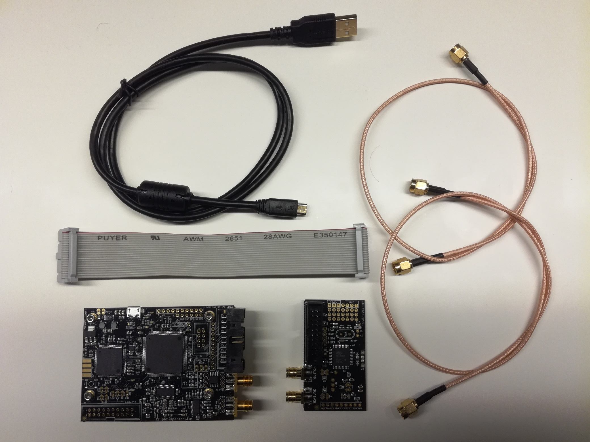
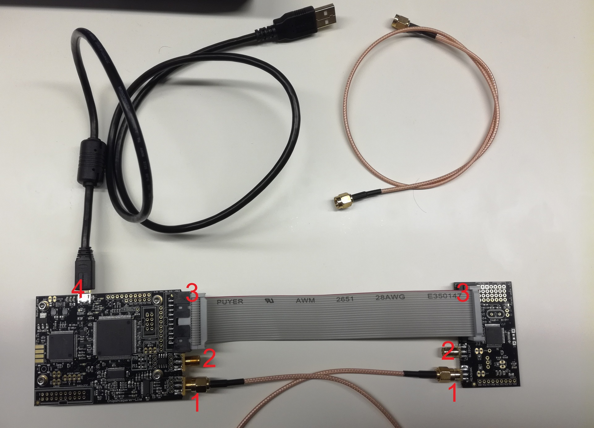

Computer Security Lab 5: ChipWhisperer
====

Responsible person/main contact: Joni Liljeblad

## ToC
* [Preliminary tasks](#Preliminary-tasks)
* [Introduction](#Introduction)
    * [Practical arrangements of this lab](#Practical-arrangements-of-this-lab)
    * [Short intro to power analysis](#Short-intro-to-power-analysis)
    * [Grading](#Grading)

* [Setting up](#Setting-up)
    * [Hardware setup](#Hardware-setup)
    * [Software setup](#Software-setup)

* [Tasks](#Tasks)
  * [Task 1](#Task-1)
  * [Task 2](#Task-2)
  * [Task 3](#Task-3)
  * [Task 4](#Task-4)

# Preliminary tasks

Get familiar with following background information of ChipWhisperer and power analysis

* [Power analysis on wikipedia](https://en.wikipedia.org/wiki/Power_analysis)
* [ChipWhisperer's Introduction to Side-Channel Power Analysis training video](https://www.youtube.com/watch?v=OlX-p4AGhWs)
  * 00:00-20:00, very basic things about what is encryption (You can easily skip this if you already handle the basics)
  * About 20:00-30:00, encryption and hardware
  * About 30:00-55:00, very detailed explanation how power analysis attack against AES works
  * About 55:00-end, explanation how this attack applies to real world and demonstration of the usage of ChipWhisperer tools and software
  * If you cannot watch the video, about same information than important parts of this video can be found in heavily compressed form at next article [Correlation Power Analysis](http://wiki.newae.com/Correlation_Power_Analysis)

# Introduction

This week’s theme is hardware security so also this lab considers hardware security by giving examples of side channel attacks. In this lab you will be using ChipWhisperer hardware and tools to perform side channel experiments.

[Chipshisperer](https://newae.com/tools/chipwhisperer/) is an open source toolchain dedicated to hardware security research. ChipWhisperer project intends to make easy start on hardware security experimenting for anybody who interested about it.

ChipWhisperer device consists of 2 parts:
* Capture board is specialized hardware which is able to capture traces from target
* Target board is just some kind of processor which is programmed to perform some kind of secure operation

Basic idea of this lab is simple: We have target device which runs secure operations and we want to reveal information about those operations by measuring and analysing power consumption of target device. 

This lab exercise intends to give examples of different ways to hack into hardware. There is no guarantee that exactly these hacking examples would be working or practical in real life situations, but main goal is to educate students about possibilities of hardware hacking.

This "Introduction" section contains background information about power analysis, information of practical arrangements of this lab and information about grading information of different tasks. Next "Setting up" section contains all instructions what you are required to do before you can start making tasks. Section "Tasks" contains all 4 tasks and instructions how to do them.

## Practical arrangements of this lab

This lab is little bit different than others because tasks require the usage of external device. Number of devices are limited which causes some difficulties to arrangements.

* Students are encouraged to do labwork in groups of 2 or 3 if possible. 
* Students are encouraged to borrow device do the lab ahead of schedule to balance load on actual lab week
* We try to arrange loaning times so that everyone would have chance to hold device at least couple of days if they want.

## Short intro to power analysis

Power analysis is a branch of side channel attacks where power consumption data is used to study hardware device to extract some secret information from it. Power analysis attack is non-invasive by nature because it usually consists of sending varying but valid input data to the device and then comparing the power consumption of different runs with each other or power consumption models.

More information about principles of power analysis can be found from [Wikipedia](https://en.wikipedia.org/wiki/Power_analysis) and more ChipWhisperer-related information about CPA can be found from manufacturers [wiki](http://wiki.newae.com/Correlation_Power_Analysis)

## Grading

Task of this lab are divided to 4 different tasks which have corresponding grades in table below. Notice that *Good-to-have skills* are only directional descriptions about required skill levels.

Task| Grade/Level | Description | Good-to-have skills
--|:--:|--|--
1|2|Getting started with ChipWhisperer, inspecting power traces and breaking AES|Basic understanding of C and Assembly code, reading and understanding technical articles, basic understanding of statistics
2|3|Password bypass with timing attack and breaking RSA with power and timing analysis|Simple Python coding
3|4|Glitching|Python skills, patience, C and Assembly
4|5|Several alternatives for advanced experimenting|Different advanced skills depending on your project

---

# Setting up

Due to external device and specialized software, this lab needs some extra work to set everything up.

## Hardware setup



Device package should contain next items
* ChipWhisperer Lite 1173 Main board
* CW303 XMEGA Target board
* Serial cable
* 2 SMA cables
* USB cable

Do next steps to prepare device for usage
* Connect serial cable to serial ports of main board and target board
* Connect SMA cable to measure ports of main board and target board
    * If you are doing glitching-related tasks, you must connect also glitch ports with second SMA cable
* Connect USB cable to main board

Ending result should look like next (if you do not need glitch ports)


Numbers in image are marking next ports:
1. Measure ports
2. Glitch ports
3. Serial cable ports
4. USB port

**NOTICE: Handle device with carefully. Static electricity might be harmful to board. Some ports might be little tight, but device still should be able to be assembled without excessive usage of force.**

More detailed documentation of the device can be found from http://wiki.newae.com/CW1173_ChipWhisperer-Lite , but it should not be needed for basic tasks.

## Software setup

In this lab we will use ChipWhisperer software version 5.2.1, which runs in the Jupyter Notebook.
There exists setup with virtual machine and that is recommended way to use it in this course.
Download link(s) to that virtual machine can be found on Moodle.

### Course VMWare virtual machine (OVA import)

Download (link in Moodle) virtual machine. Open OVA file and wait for it to get imported. Fist import might fail, but just click "Retry".

On first run, you must login virtual machine (user/password: vagrant/vagrant)
and run command `ip address` to get the connectable address of Jupyter Notebook. Use that address in your browser
with port 8888. Password for jupyter is "jupyter".

On next logins, you do not have to login to virtual machine, server is running without login and address should be the same.

* Device might not connect correctly if you do not give correct USB Controller setting on virtual machine settings (Use USB Compatibility 2.0)

### Course VirtualBox machine

Download (link in Moodle) and start virtual machine and connect localhost:8888 with your web browser. Password for jupyter is "jupyter".

* If your connection fails when you try to connect your board first time, you may have to download and install VirtualBox extensions to make USB connection to work. 

### Clear VirtualBox machine

You can use clear virtual machine from ChipWhisperer GitHub too. Download virtual machine from [GitHub](https://github.com/newaetech/chipwhisperer/releases/tag/5.2.1)
and run it (you may have to set up password yourself on first startup). New version (5.3) is released, but take version 5.2.1. Login to virtual machine (user/password: vagrant/vagrant),
setup Jupyter password and reboot. Connect localhost:8888 with your web browser.

* If your connection fails when you try to connect your board first time, you may have to download and install VirtualBox extensions to make USB connection to work. 

### Other

If you already have instance of Jupyter Notebook running on your system, then feel free just to install ChipWhisperer software on it.

If you want to make custom installation on your machine follow instructions [here](https://chipwhisperer.readthedocs.io/en/latest/installing.html).

These options have not been tried, so no guarantees about those (but there should not be any reason why that should not work either).

## Remote ChipWhisperer machine

This year we are testing for the first time remotely usable ChipWhisperer setup that can serve multiple users simultaneously.

Contact course assistants to receive your username, private key and instructions to connect to the system.

You need university account to perform SSH jump to reach the server.

When you connect system, device is allocated to you and virtual machine using the device is automatically started for you. This means that you do not have to install anything or worry about borrowing device at all. Sounds great, right? This is tried first time so let's see how well it will work.

---

# Tasks

Start your work from Task 1 and proceed to harder ones. Every task is designed to require more skills and amount of work than previous one.

Task 1 and 2 together are designed to take about 4+ hours to complete. Try to finish those at lab session. You can borrow equipment if you want to continue working with those tasks at home.

Tasks 3 and 4 are more laborious and it is likely that those can not be done in time limit of single lab session. You must discuss about borrowing equipment with lab assistants if you want to do those tasks.

Read task instructions carefully before starting to work to have clear picture about what you are supposed to do. Every task should be clearly stating what you are expected to do and return.

Most of the tasks are based on ChipWhisperer tutorials which are located in folder */jupyter/*. Programs running on the target device are located at */hardware/victims/firmware*.

**If you are doing this work in group, remember to mark down clearly which of you participated on which tasks**

## Task 1

Task 1 tasks are meant to be relatively simple tasks to help you understand that what is the Chipwhisperer device and what can be done with it. You will learn how to connect the board, inspect power traces and use ChipWhisperer analyzer program.

ChipWhisperer software and tutorials utilize Jupyter Notebook. Everything is packed in ready-to-run virtual machine which can be found on university drive or Chipwhisperer github page.

If you have not used Jupyter Notebook before, it can be beneficial to complete tutorial !!Introduction_to_Jupyter!!.ipynb

## A) Getting started with device, jupyter and SimpleSerial protocol

**Complete ChipWhisperer basic tutorial named *PA_Intro_1-Firmware_Build_Setup.ipynb*.** Purpose of this part is simply to give you some experience of the basic usage of ChipWhisperer which is required in later tasks of this lab exercise.
**You are not required to return anything for this task**, but it is critical that you learn to use ChipWhisperer on basic level because otherwise all other tasks are very difficult to complete. Basically important things what you will be doing in that tutorial are next:

1. Learn what is SimpleSerial
2. Build basic example (**Notice: Target platform is type CW303 and you have to build program for that platform. You have to ensure this in all of the tasks of this lab.**)
3. Modify basic example and rebuild it
4. Use scripts to connect (and disconnect) the device
5. Upload built example to the target device and capture traces and input&output text

If you have never used Jupyter Notebook before, consider doing tutorial *!!Introduction_to_Jupyter!!.ipynb* first.

__TIPS & TRICKS__
* You might have to unplug & plug USB cable again if computer or the capture software does not recognize the device. You also might have to unplug & plug device from virtual machine top right corner to make it detect it.
* Notice that you have to be connecting serial cable and measure ports, glitch port is not needed in this task.
* Beware of static electricity. Discharge of static electricity can be harmful to board.

## B) Inspecting power differences of simple operations

Next we will inspect how the different operations on victim affect to the power consumption of it. As you already intuitively know, not every operation processor performs is equal: Some operations are more complex than others, causing them to consume more power and clock cycles than other operations. By measuring power consumption from target, therefore we can deduce what operation is performed and when.

**This task is completed by doing tutorial *PA_Intro_2-Instruction_Differences.ipynb*** and analyzing produced results. Do the sections 1.1-1.4 of the tutorial to familiarize yourself with modifying code and plotting and inspecting traces.

After completing simple loop comparison tests, we will inspect power differences between single instructions:

Edit previously modified code (all codes for the victims are located at *hardware/victims/firmware/*) to contain single NOP an MUL instructions like this:


```c
/**********************************
 * Start user-specific code here. */
trigger_high();

//16 hex bytes held in 'pt' were sent
//from the computer. Store your response
//back into 'pt', which will send 16 bytes
//back to computer. Can ignore of course if
//not needed

asm volatile(
"nop"       "\n\t"
"nop"       "\n\t"
"nop"       "\n\t"
"nop"       "\n\t"
"nop"       "\n\t"
"nop"       "\n\t"
"nop"       "\n\t"
"nop"       "\n\t"
"nop"       "\n\t"
"nop"       "\n\t"
::
);

asm volatile(
"mul r0,r1" "\n\t"
"mul r0,r1" "\n\t"
"mul r0,r1" "\n\t"
"mul r0,r1" "\n\t"
"mul r0,r1" "\n\t"
"mul r0,r1" "\n\t"
"mul r0,r1" "\n\t"
"mul r0,r1" "\n\t"          
"mul r0,r1" "\n\t"
"mul r0,r1" "\n\t"
::
);

trigger_low();
/* End user-specific code here. *
 ********************************/

```

Above code performs first 10 NOP (no-operation) instructions and after that 10 MUL (multiplication between registers r0 and r1).

Remember always that anytime you make modifications to program, you have to rebuild it and reprogram the device. Also make sure that you are uploading correct program to device.

Inspect results when you change amount of instructions / add more blocks of different instructions. Try to detect different instructions executing from the trace.

> You can use different gain setting (25 should be fine) to make trace more readable

> Remember that your device is ChipWhisperer Lite and target CW303, so always use `SCOPETYPE = 'OPENADC'` and `PLATFORM = 'CW303'` as settings

### What to return in this task?

Make program consisting of varying amounts of NOP and MUL blocks containing at least 40 instructions of total and several instruction blocks mixed.

For example 15 x NOP, 15 x MUL, 10 x NOP, 10 x MUL could be complex enough.

Take screenshot of resulting trace and add textual description / draw on image where are those instructions happening ("From sample x to y there executes 10 instructions of z" etc).

Add answer to return template.

> Remember also that you must disconnect device from one notebook with
> ```Python
> scope.dis()
> target.dis()
> ```
> before using device with next tutorial


## C) Breaking AES

Previous task considered power differences between single operations, which might not be very practical itself. However this task will be hopefully more interesting and related to real world than basic inspection of single operations.

In this task we are going to break AES with Correlation Power Analysis attack.

**This task is done by completing ChipWhisperer tutorial *PA_CPA_2-Manual_CPA_Attack.ipynb*** and explaining theory behind attack.

There exists also tutorial *PA_CPA_1-Using_CW-Analyzer_for_CPA_Attack.ipynb* which uses pre-existing utility scripts of 
ChipWhisperer Analyzer software, but we will do this task more low-level way (feel free to complete that tutorial too if you like fancier outputs!).

More common information about AES can be found [here](https://en.wikipedia.org/wiki/Advanced_Encryption_Standard)

If you have no access to device, you can ask saved project containing necessary traces from your friend or course assistant.

### What to return in this task?
Next 2 things:

**Screenshot of your attack successfully solving the key**

**Explain how the correlation power analysis attack that you just performed works.**

Theoretical information about the attack you just performed can be found here http://wiki.newae.com/Correlation_Power_Analysis Tutorial you just completed contain already quite technical description what is happening in attack.

Your answer does not have to be in any certain "format" or any minimum length. Only requirement is that it explains issue well and shows that you have really investigated attack you performed deeper than surface level.

If you have troubles in your writing, you can consider next list of questions as your checklist. Finding answers to those questions should produce decent overall result.
* What are major steps of the correlation power analysis attack you just performed? Explain each phase shortly.
* What sensitive point of AES algorithm implementation targeted in this attack? Describe sensitive point and the power leakage model used to attack it.
* How is single subkey solved? Describe the calculations performed when attack tries to solve single subkey.
* Did you manage to find out correct encryption key as end result? Was end result completely right or were some subkey guesses wrong? If yes, discuss reasons of it and how could it be possible to fix.

---
# Task 2

In task 2, there is 2 tasks which require closer analysing of power traces with small Python scripts.

You will learn how to pass simple password check by power analysis and how to solve RSA private key bits by measuring execution time.

## A) Password bypass with power analysis
In this task you will break in to secure device by analysis of the power traces of device when it processes your login attempts.

Program to be hacked is simple: It prints initial information, waits for user to input login password and check if it is right. If it is, program prints welcome text and lights up green led. If not, program reports failure and red led turns on.

Program compares inputted password against correct password character by character and ends comparing if wrong character is encountered. This kind of process is obviously vulnerable against timing attacks. In this program, timing attack is countered by adding random wait time after failed password input.

Catch here is that login system is still vulnerable to power analysis, which will be utilized here. With power analysis, we can see every character being processed and therefore we can determine when program hits the wrong character.

This task is completed by completing tutorial *PA_SPA_1-Timing_Analysis_with_Power_for_Password_Bypass.ipynb* and succeeding in the breaking full password with simple power analysis. You do not have to do part 1.8 of the same tutorial considering SAD approach to this task.

Scripts for making password bypass attack are provided in tutorial, but values in them are not correct for your device, and you have to solve those yourself to make your attack working.

__HINT__: You can use password guesses where the first letter is wrong, then the second etc. This should give you an idea how the power trace differ with different inputs. You can easily compare traces with different inputs by modifying next provided code:

```Python
%matplotlib notebook
import matplotlib.pylab as plt

trace_correct = cap_pass_trace("h0px3\n")
trace_wrong   = cap_pass_trace("xxxxx\n")

     
plt.plot(trace_wrong, 'r')
plt.plot(trace_correct, 'g')
```

__HINT__: Notice that you might speed up testing some amount by putting known correct characters earlier to testing list. Notice that you should still put some incorrect character as first of the testlist. Otherwise you might end up in the situation during testing that your wrong code selects always the first character of your list, but because it happens to be correct one, you might think that code is right.

Your ending result (and requirement to gain points from this task) should be script which automatically solves whole password for you.

### What to return in this task?

You must return next 2 items to return template to gain points from this task:
1. Your working attack script. You can just return just the part(s) you modified in that provided attack code.
2. Screenshot of output after your code has successfully solved correct password.

## B) Breaking RSA
In this task you will explore the principles of breaking RSA implementation by analysing power traces. Basic idea is to detect conditional code branch execution from power trace and then deduct the private key that device uses internally.

First we discuss about theory of attack against RSA implementation and after that instructions for this task and what to return are given.

### Theory

First, if you do not know what is RSA, you can find basic information about if from https://en.wikipedia.org/wiki/RSA_(cryptosystem).

This is some code from RSA implementation from avr-crypto-lib
```C
uint8_t rsa_dec_crt_mono(bigint_t* data, const rsa_privatekey_t* key){
	bigint_t m1, m2;
	m1.wordv = malloc((key->components[0].length_B /* + 1 */) * sizeof(bigint_word_t));
	m2.wordv = malloc((key->components[1].length_B /* + 1 */) * sizeof(bigint_word_t));
	if(!m1.wordv || !m2.wordv){
		//Out of memory error
		free(m1.wordv);
		free(m2.wordv);
		return 1;
	}
	bigint_expmod_u(&m1, data, &(key->components[2]), &(key->components[0]));
	bigint_expmod_u(&m2, data, &(key->components[3]), &(key->components[1]));
	bigint_sub_s(&m1, &m1, &m2);
	while(BIGINT_NEG_MASK & m1.info){
		bigint_add_s(&m1, &m1, &(key->components[0]));
	}

	bigint_reduce(&m1, &(key->components[0]));
	bigint_mul_u(data, &m1, &(key->components[4]));
	bigint_reduce(data, &(key->components[0]));
	bigint_mul_u(data, data, &(key->components[1]));
	bigint_add_u(data, data, &m2);
	free(m2.wordv);
	free(m1.wordv);
	return 0;
}
```

You notice that `bigint_expmod_u` is called with private key material. Next we look at source code of it.
```C
oid bigint_expmod_u(bigint_t* dest, const bigint_t* a, const bigint_t* exp, const bigint_t* r){
	if(a->length_B==0 || r->length_B==0){
		return;
	}

	bigint_t res, base;
	bigint_word_t t, base_b[MAX(a->length_B,r->length_B)], res_b[r->length_B*2];
	uint16_t i;
	uint8_t j;
	res.wordv = res_b;
	base.wordv = base_b;
	bigint_copy(&base, a);
	bigint_reduce(&base, r);
	res.wordv[0]=1;
	res.length_B=1;
	res.info = 0;
	bigint_adjust(&res);
	if(exp->length_B == 0){
		bigint_copy(dest, &res);
		return;
	}
	uint8_t flag = 0;
	t=exp->wordv[exp->length_B - 1];
	for(i=exp->length_B; i > 0; --i){
		t = exp->wordv[i - 1];
		for(j=BIGINT_WORD_SIZE; j > 0; --j){
			if(!flag){
				if(t & (1<<(BIGINT_WORD_SIZE-1))){
					flag = 1;
				}
			}
			if(flag){
				bigint_square(&res, &res);
				bigint_reduce(&res, r);
				if(t & (1<<(BIGINT_WORD_SIZE-1))){
					bigint_mul_u(&res, &res, &base);
					bigint_reduce(&res, r);
				}
			}
			t<<=1;
		}
	}

	SET_POS(&res);
	bigint_copy(dest, &res);
}
```

If you look closely at variable `t` in the loop, you can see that it contains the private key which is shifted one bit left on every round. Next code compares if it has 1 or zero as MSB.
```C
bigint_square(&res, &res);
bigint_reduce(&res, r);
if(t & (1<<(BIGINT_WORD_SIZE-1))){
	bigint_mul_u(&res, &res, &base);
	bigint_reduce(&res, r);
}
```

This is execution dependent on our private key, and if we can deduce which branch is executed, we could determine the private key bits one by one!

### Task

**This task is completed by doing ChipWhisperer tutorial *PA_SPA_2-RSA_on_XMEGA_8bit.ipynb***. You will be doing only SAD-based attack part of it (so you do not have to do part 1.5).

Custom version of RSA is used in this task. It has stripped version of RSA decryption algorithm, which is running only the vulnerable part of decryption algorithm and using only last 16 bits of private key. You may read code from *hardware/victims/firmware/simpleserial-rsa/simpleserial-rsa*.

Follow the tutorial and solve encryption key by finding reference sample and measuring execution time of encryption loops as instructed.

Notice that sample and delta values in tutorial are most likely producing bad SAD match plot and wrong overall results. You are required to inspect traces yourself as you see fit and find correct values yourself.

> **NOTICE:** Command ```fw_path = '../hardware/victims/firmware/simpleserial-rsa/simpleserial-rsa-CWLITEXMEGA.hex'``` in the beginning of the tutorial points to nonexistent binary when you use CW303 as platform. Change this command accordingly.

**Hints:**
* Closely inspect to try find nice reference pattern for SAD calculation. Easily distinguishable close-to-zero spikes mean that good match is found.
* Pay attention how many matches are found/needed

### What to return in this task?

**After you have working attack, fill next answers to return template**
 
1. Your attack code (parts you had to modify yourself are enough) and screenshot demonstrating it outputting correct result.
2. Thought-out answer to next question: *Can you solve the last bit of 16-bit key with provided code? You can try re-record trace with key ABE3 and try to solve key from that trace. If not, tell why it did not work. How would you make it work? Note that you do not have to implement your answer, just telling that how you would do it is enough.* (HINT: Consider the amount of close-zero spikes you have in your SAD plot)

---
# Task 3

A glitching attacks utilize intentional faults to undermine device security. These faults can for example cause instruction skipping, malformed data reads / write backs and instruction decoding errors.

In this task you will learn basic fault injection to device to make it behave unintended way: Skipping login prompts, overreading buffers and injecting faults to encryption algorithms to reveal private key are all possible with skilled glitching!

> **Remember to attach SMA cable to glitch ports of the device before starting.**

> Remember to use `PLATFORM = 'CW303'` as platform setting when you compile your code for the target

## A) Introduction to clock glitch attacks

**Fist task is to pass simple clock glitching tutorial *Fault_1-Introduction_to_Clock_Glitch_Attacks.ipynb***. In this tutorial you will learn what is clock glitching and you will find suitable glitching parameters for your device to be used in later tasks.

Tutorial is rather straightforward, but searching of the glitch parameters can take some time. Go and grab cup of coffee while search is running.

Tutorial offers working attack code for function `glitch3()`, but code uses tnrange function that does not support decimal step ranges.
You likely have to modify code to support smaller steps to make attack work.
This can be done easily by using `arange` from `numpy` instead of `tnrange`.
Add additional print inside loop to follow execution of code in this case.

Notice also that in provided attack code contains next:
```Python
if PLATFORM == "CW303" or PLATFORM == "CWLITEXMEGA":
    pass
```
This is obviously not working and you have to add code to it yourself.

You can consider yourself successful when you manage to glitch trough functions `glitch1()` and `glitch3()`. Take screenshots of your success and put those in the return template. Important in this tutorial is to find correct parameters for glitching for the future usage and accustome yourself to clock glitching.


## B) Buffer glitch attack

**In this task you will complete tutorial *Fault_3-Glitch_Buffer_Attacks.ipynb***. Do parts 1.1-1.3, which concentrate on attacking unsafe assebly code.

Sections 1.1 and 1.2 are just introduction to this task and you do not have to return or answer anything from them.
Section 1.3 is considering actual attack and main point of this task.

Attack code is already provided and it most likely works without additional tweaking, so this part should be quite straightforward.
After being successful in attack (section 1.3), take screenshot of results and answer following additional questions in your return template.

> You can tune tried glitch parameters to the ones that you retrieved in the last task

> You can improve glitch parameter testing by using `arange` from `numpy` instead of `tnrange` as you probably did in last task.

**Additional questions:**

When you manage to glitch decrypted data out of the device with given attack code in section 1.3, consider next:

Attack is based on the vulnerable code created by compiler optimizations.

Change loop counting variable ``i`` from line 140 of ``bootloader.c`` (the vulnerable part where glitch attack targets) to form

```c
volatile int i;
```

Look at file `bootloader-CW303.lss` before and after recompilation. Answer next questions to your return template:
How does the assembly code change (how assembly look before/after) at changed part? What happens if you manage to find new loop ending place and make successful glitch to it?
Is similar attack against this kind of code possible anymore? If not, how attack could be evolved? (you do not have to implement your ideas)

## C) Differential Fault Analysis on AES

You already broke AES implementation key in task 1C, but there is more ways to steal private key from the device.

In this task you will inject faults into specific place of running algorithm and compare outputs to non-faulty encryption runs in order to determine private key information

Main steps of AES are nicely described in [Wikipedia article](https://en.wikipedia.org/wiki/Advanced_Encryption_Standard).

**In this task you will be completing tutorial *Fault_4-AES_Differential_Fault_Analysis_Attacks.ipynb*.**
Tutorial contains rather straightforward descriptions and scripts for this attack, but glitch parameters and the correct place of execution to be glitched are wrong (consecutively handy plot drawing places of 8th, 9th and 10th round execution is wrong too).
You must find correct places to glitch yourself (for example between last 2 MixColumn steps for 9th round key as described in tutorial)
and you can use values of width and offset for the glitch from the previous task when you find out those for your device.
This task may take some time because analysis script needs enough different glitches to solve correct key.

When you have completed tutorial, take screeshot/copy script output to return sheet to show that you have calculated correct key by injecting faults to correct places of code.
Specify also the glitch parameters you used in your attack script.
Also answer shortly to next questions: **Describe shortly how the attack you performed is working. What kind of glitches are hoped to happen? Why certain point for the attack? What is the difference between 8th and 9th round attack? Why solving the round key is interesting?**

> This task has been proven little tedious, so small hints could be needed:
> 
>Do not overextend amount of captures, under 1000 or even 500 from right place should be successful.
>Most important thing to be right is to get ```extoffset_range``` right, because glitching must happen in right place to make this work at all.
>About 500 samples wide area should be enough for that. For ```offset_range``` you could use previously found values which produce decent amount of glitches.
>```glitch_repeat``` should be ok at 5 and for ``width_range`` something between 6\*MIN_STEP and 8\*MIN_STEP could be tried.
>
>Notice that glitching is tedious process and even these hints may not help you at all.
>If even exhaustive attempts do not bring success, consider moving to task 4 instead. Those are not easy either, but doing those should be more "predictable" by nature.

---
# Task 4 

Still want something more complex? Choose the option you like and start pushing forward and write report about it. Notice that this task is most likely more challenging and laborius than previous ones (as you probably already guessed).

There is no answer template for these tasks. Option 1 has some more specific advice what to return, but remember next advice if you do other options:
 * Report must clearly show the all work you did. Otherwise it would be really hard to give you any kind of grade.
 * Also remember that even if long and exhaustive report is usually considered as good, you do not have to be *too* exhaustive. We would like to see students use their time to do interesting experiments rather than using time to write overly long reports. You yourself decide what is important to tell and what is not.
 * Notice that even failed attempts might give you some points if report shows that your try was well thought out.

## Option 1. Tutorials

* Complete tutorial *PA_DPA_3-AES_DPA_Attack.ipynb*. Tutorial explains quite well what is happening, but the code solving ghost peak problem is not working as intended.
You have to find out why and then write working code (not huge amount of changes needed!). Return at least next items/answers:
    * How this attack differs from AES CPA attack? Explain shortly
    * Why do ghost peaks exist? Explain shortly
    * Your working code (notice that it still might not be able to solve perfectly ALL bytes of key)
    
* Complete tutorial *PA_Profiling_1-Template_Attacks_HW_Assumption.ipynb*. Tutorial is rather straightforward and fast to complete,
but it solves just first byte of the key and it uses Hamming Weight calculations. Your task is to create attack code
that will solve whole key and without Hamming Weight modeling. End of tutorial has some advice to it. Return at least next items/answers:
    * How this differs on DPA and CPA attacks against AES? Explain shortly
    * Your working attack code, which solves full key without Hamming Weight calculations
    * How many template traces are needed to solve key reliably with just single trace from target? Is amount feasible? Experiment yourself.
        * Look what kind of results you will have with different amount of template traces and when more than single attack trace is used. Are guesses improving and how fast? Is it feasible to achieve "single trace capture success" in the sensible time?

**NOTICE:** When capturing huge amount of traces (20k+), default 2GB RAM for virtual machine is most likely not enough (some crashes has occurred).
Consider allocating at least 4GB or more RAM.

These tasks do not have return template so you have to create your own. Do not limit yourself to above questions/items:
You can tell anything that feels relevant in your return template (e.g. any problems encountered or other ideas about possible solutions).

## Option 2. Glitch or analyze your own target hardware

Alternatively you can attempt to glitch or analyze your own device. For example there is a [tutorial how to glitch raspberry pi](https://wiki.newae.com/V4:Tutorial_A3_VCC_Glitch_Attacks#Glitching_More_Advanced_Targets:_Raspberry_Pi) or how to [glitch LPC1114.](http://wiki.newae.com/Tutorial_A9_Bypassing_LPC1114_Read_Protect) Feel free to search examples from internet or ChipWhisperer wiki for ideas for additional targets. Document your process. Tell what kind of own experiments you tried or tutorial/blog post/etc you tried to repeat, how you did it and did you succeeded or not.

__Note:__ **If you decide to glitch/analyze external device you are responsible for the target device. We are not responsible if you brick your device by glitching it**

## Option 3. Your choice
If you have some other topic that uses ChipWhisperer or is related to hardware security and you are interested on trying it you can do it and document the process and the results. For example, you could look for ideas presented in ChipWhisperer tutorials and theory articles and think how you could use them in your experiments. Notice that to be accepted as task 4 your own idea must be about equal level of required skill and workload than option 1 and 2 are. __REMEMBER:__ before you do your special idea please contact the assistants and make sure that the topic is ok.

Notice that you can also just go and ask any additional ideas from course assistants. They might have some interesting basic ideas which are yet not so refined that those could be proposed in this documentation. But they are happy to share them with you and it is up to you to further refine idea.
