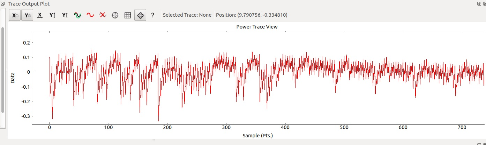

Computer Security Lab 5: ChipWhisperer
====

## ToC

* [Introduction](#Introduction)
    * [Practical arrangements of this lab](#Practical-arrangements-of-this-lab)
    * [Short intro to power analysis](#Short-intro-to-power-analysis)
    * [Grading](#Grading)

* [Setting up](#Setting-up)
    * [Hardware setup](#Hardware-setup)
    * [Software setup](#Software-setup)

* [Tasks](#Tasks)
  * [Task 1](#Task-1)
  * [Task 2](#Task-2)
  * [Task 3](#Task-3)
  * [Task 4](#Task-4)

* [Ideas for coursework](#Ideas-for-coursework)

# Introduction

This week’s theme is hardware security so also this lab considers hardware security by giving examples of side channel attacks. In this lab you will be using ChipWhisperer hardware and tools to perform side channel experiments.

[Chipshisperer](https://newae.com/tools/chipwhisperer/) is an open source toolchain dedicated to hardware security research. ChipWhisperer project intends to make easy start on hardware security experimenting for anybody who interested about it.

ChipWhisperer device consists of 2 parts:
* Capture board is specialized hardware which is able to capture traces from target
* Target board is just some kind of processor which is programmed to perform some kind of secure operation

Basic idea of this lab is simple: We have target device which runs secure operations and we want to reveal information about those operations by measuring and analysing power consumption of target device. 

This lab exercise intends to give examples of different ways to hack into hardware. There is no guarantee that exactly these hacking examples would be working or practical in real life situations, but main goal is to educate students about possibilities of hardware hacking.

This "Introduction" section contains background information about power analysis, information of practical arrangements of this lab and information about grading information of different tasks. Next "Setting up" section contains all instructions what you are required to do before you can start making tasks. Section "Tasks" contains all 4 tasks and instructions how to do them.

## Practical arrangements of this lab

This lab is little bit different than others because tasks require the usage of external device. Number of devices are limited which causes some difficulties to arragements.
* Students are encouraged/forced to do work in groups of 2 or 3 persons in lab sessions. Size of group heavily depends on how many students attend to lab sessions.
* Students are encouraged to borrow device do the lab ahead of schedule to balance load on actual lab week
* Students can borrow devices after/between lab sessions to continue working on tasks at home (alone, in same group or even with different people). In these cases pay close attention of **marking down clearly who participated on which tasks** because it is only way everybody can get the right amount of points when works are graded.
* We try to arrange loaning times so that everyone would have chance to hold device at least couple of days if they want.
* You may use ChipWhisperer device in your coursework, but notice that how long you can keep device yourself is heavily depending how much other people are wanting to borrow them. Discuss with course assistants as early as possible if you want to use ChipWhisperer in your coursework.

## Short intro to power analysis

Power analysis is a branch of side channel attacks where power consumption data is used to study hardware device to extract some secret information from it. Power analysis attact is non-invasive by nature because it usually consists of sending varying but valid input data to the device and then comparing the power consumption of different runs with each other or power consumption models.

More information about principles of power analysis can be found from [Wikipedia](https://en.wikipedia.org/wiki/Power_analysis) and more ChipWhisperer-related information about CPA can be found from manufacturers [wiki](http://wiki.newae.com/Correlation_Power_Analysis)

## Grading

Task of this lab are divided to 4 different tasks which have corresponding grades in table below. Notice that *Good-to-have skills* are only directional descriptions about required skill levels.

Task| Grade/Level | Description | Good-to-have skills
--|:--:|--|--
1|2|Getting started with ChipWhisperer, inspecting power traces and breaking AES|Basic understanding of C and Assembly code, reading and understanding technical articles, basic understanding of statistics
2|3|Password bypass with timing attack and breaking RSA with power and timing analysis|Simple Python coding
3|4|Glitching|Slightly more complex Python coding
4|5|Several alternatives for advanced experimenting|Different advanced skills depending on your project

---

# Setting up

Due to external device and specialized software, this lab needs some extra work to set everything up.

## Hardware setup


Device package should contain next items
* ChipWhisperer Lite 1173 Main board
* CW303 XMEGA Target board
* Serial cable
* 2 SMA cables
* USB cable

Do next steps to prepare device for usage
* Connect serial cable to serial ports of main board and target board
* Connect SMA cable to measure ports of main board and target board
    * If you are doing glitching-related tasks, you must connect also glitch ports with second SMA cable
* Connect USB cable to main board

Ending result should look like next (if you do not need glitch ports)


Numbers in image are marking next ports:
1. Measure ports
2. Glitch ports
3. Serial cable ports
4. USB port

**NOTICE: Handle device with carefully. Static electricity might be harful to board. Some ports might be little tight, but device still should be able to be assembled without excessive usage of force.**

More detailed documentation of the device can be found from http://wiki.newae.com/CW1173_ChipWhisperer-Lite , but it should not be needed for basic tasks.

## Software setup

To connect and use ChipWhisperer device and analyze power traces, you need ChipWhisperer software installed on your machine. There is 3 different ways to do that, choose the one that suits you best.

* Option 1: We recommend that you use preconfigured virtual machine image (VMWare) of this laboratory exercise. It has everything installed and all scripts set ready. To get image, follow instuctions at main page of this course.
* Option 2: If you do not want to use ready image or can not use WMWare images, you may download clean image from manufacturer [by following these instructions](https://wiki.newae.com/Installing_ChipWhisperer). After that clone this reposity and get setup scripts from scripts folder.
* Option 3: If you refuse to use virtual machines, you may install ChipWhisperer software your own machine [by following these instructions](https://wiki.newae.com/Installing_ChipWhisperer). There is no reason why it would not work, but notice that we have not tested this option and therefore we might not be able to help you if you run into problems which are caused by your custom installation.

If you want go go for option 2 or 3, software packages are downloadable [here](https://github.com/newaetech/chipwhisperer/releases).

This lab tasks are tested with ChipWhisperer software version 4.0.1 (which is already on this course virtual machine, no need to change anything). If you install your own system, pay attention that you get the right version of program. Tasks should be doable with 4.0.x versions of software but this is not guaranteed by any means by anybody.

Version 5.0 of ChipWhisperer software was published recently, but using it would most likely break this lab completely because changes in new version are quite massive. Changing this lab to fully support 5.0 in this timeframe was not feasible to do, so this year still uses version 4.0.

---

# Tasks

Start your work from Task 1 and proceed to harder ones without skipping any task. Every task is designed to require more skills and amount of work than previous one.

Task 1 and 2 together are designed to take about 4+ hours to complete. Try to finish those at lab session. You can borrow equipment if you want to continue working with those tasks at home.

Tasks 3 and 4 are more laborous and it is likely that those can not be done in time limit of single lab session. You must discuss about borrowing equipment with lab assistants if you want to do those tasks.

Read task instructions carefully before starting to work to have clear picture about what you are supposed to do. Every task should be clearly stating what you are expected to do and return.

**If you are doing this work in group, remember to mark down clearly which of you participated on which tasks**

Notice that some tasks (1C and 2B) require ChipWhisperer device only in early stages of task for recording power traces. This gives possibility to for example finish them at home without device if you manage to save correct traces during lab session or your friend records traces and sends them to you.

## Task 1


Ok, let's begin.

Task 1 tasks are meant to be relatively simple tasks to help you understand that what is the Chipwhisperer device and what can be done with it. You will learn how to connect the board, inspect power traces and use ChipWhisperer analyzer program.

## A) Getting started with device, capture program and SimpleSerial protocol
Complete ChipWhisperer basic tutorial B1 http://wiki.newae.com/Tutorial_B1_Building_a_SimpleSerial_Project Purpose of this part is simply to give you some experience of the basic usage of ChipWhisperer which is required in later tasks of this lab exercise. **You are not required to return anything for this task**, but it is critical that you learn to use ChipWhisperer on basic level because otherwise all other tasks are impossible to complete. Basically important things what you will be doing in that tutorial are next:

1. Learn what is SimpleSerial
2. Build basic example (Notice that ChipWhisperer device is referred as CW1173, but target chip platform is type CW303 and you have to build program for that platform)
3. Modify basic example and rebuild it
4. Use capture software to connect the device
5. Upload built example to the target device and test it

Notice that in tutorial instructions after building program are hardware-specific. Remember that your device is CW1173 (Lite) and target is XMEGA target, so you must only need corresponding sections of tutorial.

Tutorial migh have some inconsistensies, mistakes and unclear instructions, so next is very short description of main the main points of it (some of which might have stated quite unclear in that tutorial):

1. Copy, modify and build your ``simpleserial-base`` example and build it with command ``make PLATFORM=CW303``
2. Àssemble device, connect it to computer with USB, open Capture software and connect to device by running scripts **connect_cwlite_simpleserial.py** and **setup_cwlite_xmega_aes.py**
3. Program device with *Tools -> Xmega programmer*
4. Open *Tools -> Encryption Status Monitor* and hit capture 1 button couple of times to ensure that your everything is working

__TIPS & TRICKS__
* You might have to unplug & plug USB cable again if computer or the capture software does not recognize the device. You also might have to unplug & plug device from virtual machine top right corner to make it detect it.
* Notice that you have to be connecting serial cable and measure ports, glitch port is not needed in this task.
* Notice that machines default username is **cwuser** and password is **cwpassword** in case you happen to need it.
* Notice that chipwhisperer folder location may be different what is mentioned in tutorial! Chipwhisperer files are located on the desktop.
* Beware of static electricity. Discharge of static electricity can be harmful to board.
* You can open terminal on current folder from *Tools -> Open terminal* when using file explorer

## B) Inspecting power differences of simple operations

In this task, we will inspect how the different operations on victim affect to the power consumption of it. As you already intuitively know, not every operation processor performs is equal: Some operations are more complex than others, causing them to consume more power and clock cycles than other operations. By measuring power consumption from target, therefore we can deduce what operation is performed and when.

In this task you will be creating programs which repeats different types of assembly operations and capture power traces from the device to inspect them.

This task is divided 2 parts: First part considers setting everything up and understanding what is happening, and second part tells you what kind of tests you should do and items return.

This task is based on information in ChipWhisperer tutorial http://wiki.newae.com/Tutorial_B2_Viewing_Instruction_Power_Differences. You should not need original tutorial for this task, but you are free to read it as supplementary information.

### Setup & testing

In this part you will do setups and simple testing. You are not required to return anything yet, but making setups and initial testing experience is crucial for making returnable items.

Follow next instructions:

1. Create new copy of folder ``simpleserial-base`` like you did in previous tutorial task. You can rename it for example ``simpleserial-base-task-1b`` or anything you want.

2. Next, we will modify the copied simpleserial example that it performs different basic operations. Make next modifications to code:

Find next code
```c
/**********************************
 * Start user-specific code here. */
trigger_high();

//16 hex bytes held in 'pt' were sent
//from the computer. Store your response
//back into 'pt', which will send 16 bytes
//back to computer. Can ignore of course if
//not needed

trigger_low();
/* End user-specific code here. *
 ********************************/
```

And apply next changes to it

```c
/**********************************
 * Start user-specific code here. */
trigger_high();

//16 hex bytes held in 'pt' were sent
//from the computer. Store your response
//back into 'pt', which will send 16 bytes
//back to computer. Can ignore of course if
//not needed

asm volatile(
"nop"       "\n\t"
"nop"       "\n\t"
"nop"       "\n\t"
"nop"       "\n\t"
"nop"       "\n\t"
"nop"       "\n\t"
"nop"       "\n\t"
"nop"       "\n\t"
"nop"       "\n\t"
"nop"       "\n\t"
::
);

asm volatile(
"mul r0,r1" "\n\t"
"mul r0,r1" "\n\t"
"mul r0,r1" "\n\t"
"mul r0,r1" "\n\t"
"mul r0,r1" "\n\t"
"mul r0,r1" "\n\t"
"mul r0,r1" "\n\t"
"mul r0,r1" "\n\t"          
"mul r0,r1" "\n\t"
"mul r0,r1" "\n\t"
::
);

trigger_low();
/* End user-specific code here. *
 ********************************/

```

When looking at code above, you can see that program performs first 10 NOP (no-operation) instructions and after thet 10 MUL (multiplication between registers r0 and r1).

3. Ensure that you are connected to the device. Run script **setup_cwlite_xmega.py** to setup initial settings.

If you are not connected to device, connect device with instructions of previous tutorial. Or simply open capture software and run scripts **connect_cwlite_simpleserial.py** and **setup_cwlite_xmega.py**.

4. Build your new program with command `make PLATFORM=CW303` as you did in tutorial. Upload your new program to the device with XMEGA programmer like you did in tutorial.

Remember always that anytime you make modifications to program, you have to rebuild it and reupload it to the device. Also make sure that you are uploading correct program to device (forgotting it was surprisingly common mistake last year!).

5. Make sure that there is no red error light burning in capture board. Red led burning means that failure has happened with ADC and you can not capture anything. Run **setup_cwlite_xmega.py** and it should be removing error.

6. In order to be able to capture power traces we must make capture boards clock work faster. Navigate to the *Scope settings* tab in the capture software and set *Source* of *ADC Clock* to be **CLKGEN x4 via DCM**. The *ADC Freq* should show **29.5 MHz** (which is 4x 7.37 MHz), and the *DCM Locked* checkbox must be checked. If the DCM Locked checkbox is NOT checked, try hitting the *Reset ADC DCM* button again.

7. Time for your first capture! Hit the capture button and see power trace appearing.

> **HINT:** In some cases, ChipWhisperer software has some malfunction when this part is performed and it does not show any traces. You can try just simply restarting Capture software and running **connect_cwlite_simpleserial.py** and **setup_cwlite_xmega.py** again.

Interesting part of trace is actually in just in the beginning of trace, rest is futile clutter. You can zoom in to inspect the first 500 samples of trace.

8. Trace is not looking very nice, so next we will adjust settings little bit. On *Scope Settings* tab, under *Gain Setting* set the *Mode* to high. Increase the *Gain Setting* to about 25. You'll be able to adjust this further during experimentations, you may need to increase this depending on your hardware and target device. Under *Trigger Setup* set the *Total Samples* to 500, because everything interesting seems to be happening in first 500 samples of captured trace.

9. Hit capture button again to see that unneccessary parts are removed from trace plot.

10. Time to do some initial testing. Modify your program to run different amount amount of NOP and MUL instructions. Inspect how traces change. Try to detect on which points execution changes to different instruction. Also pay attention how long different instruction blocks take to execute.

You can use "Enable percistence"-button to draw traces top of each other. This should make comparing different runs easier. Consider for example adding either NOP or MUL blocks one by one to program to see how trace changes. You may also test other gain settings than in earlier setup in hope of achieving more clear differences between instructions.

When you think you have managed to detect different instructions and have good understanding what is happening, you can proceed to next part which describes what you must return on this task.

### What to return in this task?

Now it is time to make your actual returnable items for this task.

Make 3 different programs and one trace capture for each of them. Take screenshot of trace capture and describe with text where which operation happens (like next: From sample x to y there executes 10 instructions of z etc) or draw the places of different instruction blocks to screenshot with some image editor. It is up to you decide how you tell it, as long as you show somehow that you have detected different instruction executions.

Make 3 test runs with next instructions executing, take screenshots and mark down/describe which instructions are executing and where:
* 30 x NOP instructions
* 30 x MUL instructions
* Some amount of 10-sized instruction blocks and some amount of other 10-sized instruction block mixed. Total amount of them should be at least 40 (for example, 10 x NOP, 10 x MUL, 10 x NOP, 10 x MUL fulfills this requirement).

Add those 3 required items (+ possible textual explanations) to your return template to gain points from this task.

## C) Breaking AES

Previous task considered power differences between single operations, which might not be very practical itself. However this task will be hopefully more interesting and related to real world than basic inspection of single operations.

In this task we are going to break AES with Correlation Power Analysis attack scripts that already exist in ChipWhisperer software. This task is based on ChipWhisperer tutorial http://wiki.newae.com/Tutorial_B5_Breaking_AES_(Straightforward). You should not need original tutorial for this task, but feel free to read it as supplementary information.

Idea of this task is to break AES implementation by analyzing power traces captured from the device. You will be using capture software to aquire traces and analyzer software to run Correlation Power Analysis attack script.

This task is divided into 2 parts.

Fist part is very straightforward: You will compile program (which is AES 128-bit algorithm implementation) and then you flash it to the target device like you did in previous task. After that you will execute setup script for AES and then run trace capture so that it captures 50 power traces with different plaintexts.

Second part is more interesting: You will analyze captured traces with given attack scripts and find out the inner workings of scripts and Correlation Power Analysis principles.

Task should be doable by following instructions below, but feel free to look the original tutorial for hints. Especially pictures of it can be useful to help you understand what is supposed to happen during the steps.

Ok, lets start with first easy part.

1. Make sure your Chipwhisperer is still connected (Master, Scope and Target buttons on the top panel are green). If this is not the case execute the **connect_cwlite_simpleserial.py** script.
2. Build the file simpleserial-aes and load it to the target board the same way you did in the previous task. File can be found from *chipwhisperer\hardware\victims\firmware\simpleserial-aes*.

This program is the AES implementation we are going to attack. It holds secrect encryption key (128 bit) in it and it encrypts incoming data (plaintext) and returns ciphertext via SimpleSerial. 

More common information about AES can be found at https://en.wikipedia.org/wiki/Advanced_Encryption_Standard

Remember that procedure for making new programs is building program with `make PLATFORM=CW303`, then uploading resulting binary to target device with XMEGA programmer. Observation from last year showed that it is surprisingly common that mistake happens during those 2 steops so do those carefully.

3. Execute  **setup_cwlite_xmega_aes.py** script from the script list.

This setup script just makes configuration easier because it automatically configures every value (rather than you would have to do it manually via GUI). You can see what values script sets by looking at *Script Preview*-window when you select the script.

4. Press the *Capture many*-button on the top left (green triangle with the symbol ”M”).

*Capture many*-action differs from earlier used *Capture* so that it captures multiple traces at once to single set (all amounts are specified at *General Settings* tab).

5. Save the project with *File --> Save Project* option, give it any sensible name you want.

Now you have completed easy part. Next part will be more interesting.

Notice that if you managed to save correct traces in this part, you will not need ChipWhisperer device anymore because the rest of the task is considering only about saved data and not the device.

First, read the theoretical basis of CPA so you can understand better what is idea of this task. http://wiki.newae.com/Correlation_Power_Analysis Try to understand at least the major steps which are performed during attack, because it makes easier for you to understand what happens next.

6. Open the ChipWhisperer Analyzer software (shortcut is at desktop of the machine)
7. Open the file you saved in the step 5. Check from *Trace Management* (Project -> Trace Management) that you have those 50 traces you saved there.

If you do not have any traces there, something has gone wrong during capture. If you have more than 50 traces which are not in mapped range 0-49, it may cause calculations fail as some cases from last year indicated. To remove unneccessary traces, click the row and then click small minus button in the bottom of the window.

8. If everything seems to be in order, you are ready to execute actual attack script. Run script *attack_cpa.py* and wait for its execution to end.

9. After execution of script *Results Table* and other tabs should be populated with data. Inspect carefully data on every tab while considering next information
* *Results Table* contains the final output of the algorithm which is maximum correlation found on every subkey guess. It orders best quesses to top of the table. You should see the correct key bytes at first row of the table. Notice that when you saved your project in capture software the project contained also information about correct encryption key. These correct key bytes are now marked as red in the *Results Table*. Of course in normal situations this kind of cheating would not be possible and you would have to trust only calculated correlation values.
* *PGE vs Trace Plot* consideres Partial Guessing Entropy of calculations. Basically this plot tells that how high on ranking was each correct subkey when analysis of traces was continuing. It is easy to see how many traces were required before that correct subkey gained highest rank. Notice that these calculations need that correct key is known beforehand.
* *Correlation vs Traces in Attack* is very similar than above. You can see how each subkey guess correlation was developing when more traces were analysis were progressing. Notice that if there is correct key information available, program hilights correct subkey guess correlation plot as red.
* *Output vs Point Plot* shows CPA output for every point sample point for every guessed subkey. Notice that known correct subkey is marked on red (because the correct key information came with the project). Also you should notice that correct known guess also seems to have highest maximum correlation "spike".


### What to do to complete this task?

**Explain how the correlation power analysis attack that you just performed works.**

Theoretical information about the attack you just performed can be found here http://wiki.newae.com/Correlation_Power_Analysis 

Deeper technical insight and actual example code of attack can be found here http://wiki.newae.com/Tutorial_B6_Breaking_AES_(Manual_CPA_Attack) 

All information needed should be found in those two articles.

Your answer does not have to be in any certain "format" or any minimum length. Only requirement is that it explains issue well and shows that you have really investigated attack you performed deeper than surface level.

If you have troubles in your writing, you can consider next list of questions as your checklist. Finding answers to those questions should produce decent overall result.
* What are major steps of the correlation power analysis attack you just performed? Explain each phase shortly.
* What sensitive point of AES algorithm implementation targeted in this attack? Describe sensitive point and the power leakage model used to attack it.
* How is single subkey solved? Describe the calculations performed when attack tries to solve single subkey.
* Did you manage to find out correct encryption key as end result? Was end result completely right or were some subkey guesses wrong? If yes, discuss reasons of it and how could it be possible to fix.

---
# Task 2

In task 2, there is 2 tasks which require closer analysing of power traces with small Python scripts. Task 2 is significantly harder than previous task so expect that you will most likely use rest of the lab session for this task. Notice that you can easily continue working on task B at home after lab session without device if you manage to capture and save power traces for yourself.

## A) Password bypass with power analysis
In this task you will break in to secure device by analysis of the power traces of device when it processes your login attempts. You will also learn how to use Python scripts to control ChipWhisperer software. 

Target program on victim device is simple. It prints initial information, waits for user to input login password and check if it is right. If it is, program prints welcome text and lights up green led. If not, program reports failure and red led turns on.

Target program compares inputted password against correct password character by character and ends comparing if wrong character is encountered. This kind of process is obviously vulnerable against timing attacks. In this program, timing attack is countered by adding random wait time after failed password input. Catch here is that login system is still vulnerable to power analysis, which will be utilized here. With power analysis, we can see every character being processed and therefore we can determine when program hits the wrong character.

Feel free to read source code of program before building it as supplementary information.

This task is based on ChipWhisperer tutorial http://wiki.newae.com/Tutorial_B3-1_Timing_Analysis_with_Power_for_Password_Bypass. Original tutorial is not needed for this task, but you are free to look it as supplementary information.

This task can be divided to 2 different parts: Setup & warm-up and running attack.

In setup & warm-up phase you will be doing next things:
* Building and uploading program to device
* Setup initial settings by running setup scripts
* Test that target program is working
* Learn to use auxilary module for resetting target device
* Test multiple different passwords to see how power trace is affected

In running attack script part, you will modify attack script based on knowledge you aquired earlier to make attack run automatically and produce successful result.

### Setup & warm-up

First, we will setup device and do some simple experimenting with inputting different passwords. You are not required to return anything on this phase, but setupping the device and knowledge you will be acquiring in this part is crucial for the second part of the task.

If you are not doing this task with virtual machine provided by this course, you need to grab scripts **setup_password_check_delay.py**, **setup_password_check.py** and **PASSWORD_BYPASS.py** from this repository scripts-folder yourself.

1. Restart the Capture software.
2. Navigate to *\home\cwuser\Desktop\chipwhisperer\hardware\victims\firmware\basic-passwdcheck*.
3. Build the program with the command `make PLATFORM=CW303`, as you did in previous tasks.
4. Execute **connect_cwlite_simpleserial.py** in the Capture software to connect the device.
5. Execute **setup_password_check_delay.py** in the Capture software to set the parametres. You can see from *Script Preview* window which values changed.
6. Program the file you made earlier to the target board using XMEGA Programmer as you did in previous tasks. Keep the programmer window open.
7. Open terminal from *Tools --> Terminal*.
8. Press *Connect* in the Terminal. 
9. Press Check signature from Programmer window. This will reset the software in the target board and you should see text that asks for your password. Correct password is h0px3.
10. Type it to the terminal and press send. Terminal should say "Access granted, Welcome!"
11. Reset the software by pressing *Check signature* button again and try a different password to behaviour of device when wrong password is entered.

12.  Next we capture a power trace of this operation. Have the terminal and XMEGA Programmer open. Write the correct password to the terminal but do not press send yet. Then press the *Check Signature* button to reset the device.  After that press the capture trace button and then you have to press fastly send on terminal window. Try this with the correct password and with a incorrect password.

You should see that correct password power trace and wrong password power trace were different, which is main point of this task. Testing different password this way is quite tedious (because you have to manually do everything), so next we will make capture program reset device and send password automatically by using auxilary modules.

13. Execute the following scipts **setup_password_check.py** and **aux_reset_cw1173.py**.

These script will setup resetting auxilary module.

14. Now put your password guess to the *Go command* field at the *Target Settings* tab. **Remember to add `\n` at the end of your guess**.

15. Now when you press Capture Trace button the target should automatically reset, send your guess to the target board and capture a trace. Now input different passwords and observe the differences between the traces.

__HINT__: You can use password guesses where the first letter is wrong, then the second etc. This should give you an idea how the power trace differ with different inputs.

Try different passwords to gain understanding how trace behaves. For example, try password with first character wrong, then first character right but second wrong, then 2 characters right but third wrong etc. Consider using "Enable percistance"-button when drawing traces of different passwords.

In the example trace below, there is 2 correct characters in password.



### Running attack

Now its time for actual automated attack.

**PASSWORD_BYPASS.py** script in the */home/cwuser/Desktop/chipwhisperer/software/chipwhisperer/capture/scripts* folder is your attack code. It automatically does the setups, resets device between login attempts, tries every character from specified character list and then analyzes if password character was correct or not. If character was wrong, script tries next character in list and if character was right, script locks that character and starts guessing next character of password string.

Script should be visible in the Capture Software script list. If you are not using virtual machine given on this course, you must get the script from scrips-folder of this repository.

Attack script is almost ready, but if you run it, you can see that the part determining if character was correct or not is not working.

```Python
if nextTrace[153 + 72*i] < -0.2:
    continue
```

You already probably guessed that your task is to modify this part of the code to make script work automatically. You must most likely modify all hard-coded values and possibly also boolean operator comparing them.

Use your knowledge acquired from previous task and do more experimenting to see how power trace behaves with different amount of correct characters. By that knowledge you should be able to construct logical rule which can separate whether tried character was correct or incorrect.

Your ending result (and requirement to gain points from this task) should be script which automatically solves whole password for you.

Some tips which might be helpful
* During your experimenting most important thing is to find some point of power trace which is always different depending if character was correct or incorrect. Consider using "Enable percistance"-button to draw traces top of each other for easier analysis.
* Second important thing is to find out how long is the processing time of single correct character. Every time correct character is found, comparision point must be shifted forward that amount (which is done by the increasing value of variable `i`).
* You might speed up testing some amount by putting known correct characters earlier to testing list. Notice that you should still put some incorrect character as first of the testlist. Otherwise you might end up in the situation during testing that your wrong code selects always the first character of your list, but because it happens to be correct one, you might think that code is right.

### What to return in this task?

You must return next 2 items to to return template to gain points from this task:
1. Your working attack script (your modified PASSWORD_BYPASS.py). Return whole script or just the part(s) you modified.
2. Screenshot of the python console after you have successfully solved correct password with your script.

## B) Breaking RSA
In this task you will explore the principles of breaking RSA implementation by analysing power traces. Basic idea is to detect conditional code branch execution from power trace and then deduct the private key that device uses internally.

This task is based on and example scripts are taken from on ChipWhisperer tutorial http://wiki.newae.com/Tutorial_B11_Breaking_RSA. This task should be able to be completed by following instructions below, but feel free to read original tutorial as supplementary information.

This task is divided into three parts. First part is theory introduction to this task, second part contains instructions how to capture traces for analysis and third part consists of writing analysis code for those traces. First 2 parts should be fast and easily done. Third part can be considered as actual task and it contains the majority of work.

Third part of task does not require you to have device, so you can complete task at home if you have saved traces successfully or ask your friend to save those for you. Or find and download those from internet (might be tricky to find traces with correct keys, but if you do, it is ok to use them).

### Breaking RSA theory

First, if you do not know what is RSA, you can find basic information about if from https://en.wikipedia.org/wiki/RSA_(cryptosystem).

This is some code from RSA implementation from avr-crypto-lib
```C
uint8_t rsa_dec_crt_mono(bigint_t* data, const rsa_privatekey_t* key){
	bigint_t m1, m2;
	m1.wordv = malloc((key->components[0].length_B /* + 1 */) * sizeof(bigint_word_t));
	m2.wordv = malloc((key->components[1].length_B /* + 1 */) * sizeof(bigint_word_t));
	if(!m1.wordv || !m2.wordv){
		//Out of memory error
		free(m1.wordv);
		free(m2.wordv);
		return 1;
	}
	bigint_expmod_u(&m1, data, &(key->components[2]), &(key->components[0]));
	bigint_expmod_u(&m2, data, &(key->components[3]), &(key->components[1]));
	bigint_sub_s(&m1, &m1, &m2);
	while(BIGINT_NEG_MASK & m1.info){
		bigint_add_s(&m1, &m1, &(key->components[0]));
	}

	bigint_reduce(&m1, &(key->components[0]));
	bigint_mul_u(data, &m1, &(key->components[4]));
	bigint_reduce(data, &(key->components[0]));
	bigint_mul_u(data, data, &(key->components[1]));
	bigint_add_u(data, data, &m2);
	free(m2.wordv);
	free(m1.wordv);
	return 0;
}
```

You notice that `bigint_expmod_u` is called with private key material. Next we look at source code of it.
```C
oid bigint_expmod_u(bigint_t* dest, const bigint_t* a, const bigint_t* exp, const bigint_t* r){
	if(a->length_B==0 || r->length_B==0){
		return;
	}

	bigint_t res, base;
	bigint_word_t t, base_b[MAX(a->length_B,r->length_B)], res_b[r->length_B*2];
	uint16_t i;
	uint8_t j;
	res.wordv = res_b;
	base.wordv = base_b;
	bigint_copy(&base, a);
	bigint_reduce(&base, r);
	res.wordv[0]=1;
	res.length_B=1;
	res.info = 0;
	bigint_adjust(&res);
	if(exp->length_B == 0){
		bigint_copy(dest, &res);
		return;
	}
	uint8_t flag = 0;
	t=exp->wordv[exp->length_B - 1];
	for(i=exp->length_B; i > 0; --i){
		t = exp->wordv[i - 1];
		for(j=BIGINT_WORD_SIZE; j > 0; --j){
			if(!flag){
				if(t & (1<<(BIGINT_WORD_SIZE-1))){
					flag = 1;
				}
			}
			if(flag){
				bigint_square(&res, &res);
				bigint_reduce(&res, r);
				if(t & (1<<(BIGINT_WORD_SIZE-1))){
					bigint_mul_u(&res, &res, &base);
					bigint_reduce(&res, r);
				}
			}
			t<<=1;
		}
	}

	SET_POS(&res);
	bigint_copy(dest, &res);
}
```

If you look closely at variable `t` in the loop, you can see that it contains the private key which is shifted one bit left on every round. Next code compares if it has 1 or zero as MSB.
```C
bigint_square(&res, &res);
bigint_reduce(&res, r);
if(t & (1<<(BIGINT_WORD_SIZE-1))){
	bigint_mul_u(&res, &res, &base);
	bigint_reduce(&res, r);
}
```

This is execution dependent on our private key, and if we can deduce which branch is executed, we could determine the private key bits one by one!

### Capturing power traces

ChipWhisperer RSA demo is used in this task. It has 2 modes: Real RSA decryption algorithm (which is way too slow for our testing purposes) and "faked" stripped version of RSA decryption algorithm, which is running only the vulnerable part of decryption algorithm. We will be using latter one version with only 16 bits of key material (to make analysis easier and capture not too long) to demonstrate RSA vulnerability against power analysis. You can read source code from *simpleserial-rsa-xmega.c* before you compile it if you want to have deeper understanding of inner workings of real and faked algorithms.

When we use demo script (simplified version), we send *Fixed plaintext* to algorithm. This is actually misleading, because send plaintext is used as "fake private key" to decrypt message. We do not care about actual encrypted message or resulting plaintext at all because our analysis targets only on private key so actual ciphertext and plaintext are irrelevant.

In this part we setup target board, capture multiple power traces with different decryption keys and save traces to project file.

1. Start the Capture software
2. Go to */home/cwuser/chipwhisperer/hardware/victims/firmware/simpleserial-rsa*
3. Make the program with the command `make PLATFORM=CW303` like you did in previous tasks.
4. Execute **connect_cwlite_simpleserial.py** in the Capture software to connect the device (if you are not connected).
5. Execute **setup_cwlite_xmega.py** script in Capture software.
6. Load program that you just made to the target board similar way that you did in previous tasks.
7. Run script **setup_breaking_rsa.py** to setup some initial values.

**setup_breaking_rsa.py** just setups some predefined values. Notice that this is not factory-made script and this is only available in presetupped course virtual machine or this course pages scripts folder.

Script contains next setups:
```Python
target.key_cmd = ""
target.output_cmd = ""
scope.clock.adc_src = "clkgen_x1"
scope.adc.samples = 24000
```

8. On *Generic settings*, change plaintext to be fixed at value `00 00 00 00 00 00 00 00 00 00 00 00 00 00 80 00` and press capture one button to confirm that it works as expected

You should see plot with 16 repeating distinguishable somewhat-similar "blocks". You might already guess that those 16 blocks are corresponding 16 bits of private key.

You can try also next to achieve better understanding about what is happening: Change plaintext to be fixed at value `00 00 00 00 00 00 00 00 00 00 00 00 00 00 80 10`, press trace percistence button and press capture one button again. You should see slightly differing power trace being plotted over original trace. This is because key bit changes -> running time of single loop execution changes.

9. On *Generic settings*, change *Number of traces* and *Traces per set* to 2

By taking 2 trace captures per key, we can avoid situation where later in this task reference pattern would be tested against trace it was taken from if same key is wanted to be tested. Not big flaw, but because we can avoid it easily, there is no reason to not to do it.

10. Save the project file as *rsa_test_2bytes.cwp* or any other name or location that you can find easily.

Next four steps are actual trace captures. You will be saving 8 traces total. Notice that their indexing goes from 0-7.

11. Set the *Fixed plaintext* to `00 00 00 00 00 00 00 00 00 00 00 00 00 00 80 00`, press *Capture M*.
12. Set the *Fixed plaintext* to `00 00 00 00 00 00 00 00 00 00 00 00 00 00 81 40`, press *Capture M*.
13. Set the *Fixed plaintext* to `00 00 00 00 00 00 00 00 00 00 00 00 00 00 AB E2`, press *Capture M*.
14. Set the *Fixed plaintext* to `00 00 00 00 00 00 00 00 00 00 00 00 00 00 AB E3`, press *Capture M*.
15. Check from *Project --> Trace management* that you have successfully saved 8 different traces to this project.

You already used *Trace Management* tool in task 1B to inspect that you have correct traces. Just check now that you have those traces and only those traces correctly in your project before saving it.

16. Save the project to some place you can find.

Now you should have successfully saved power traces for different private keys. **NOTICE:** Capture sofware and ChipWhisperer board are not needed anymore if you have saved correct power traces successfully. You can work without them at home and still finish this task.

### Analyzing captured power traces with Python

Ok, now the actual task begins.

In this part we will write Python script that solves the secret private key by analyzing power traces.

In theory it could be possible to determine private key by examinging power traces just by looking at them and plotting them carefully on top of each other (like you were hinted to experiment at capture phase), but of course we want computer to do work for us automatically instead of performing manual labor.

Basically we will do next:
1. Load power trace data to script
2. Find good reference pattern from power trace
   * In trace there can be seen 16 rounds of looping (16 similar-looking blocks 1 for each bit of private key), and reference pattern should match to them
3. Use reference pattern to calculate places of trace where reference pattern occurs
4. Calculate distance between pattern occurences to determine how much time was consumed during single key bit processing (this solves single loop execution time)
5. Based on loop execution time information, determine if processed bit was 1 or 0 (long execution = 1, short execution = 0)

Virtual machine has already Python 2 installed and those code examples are created for it.

Lets start with loading power trace and plotting it to the image.

Create new .py file and use next example code to plot first trace to image. You can run your scripts in terminal by simply with `python yourscript.py`.

```Python
from chipwhisperer.common.api.CWCoreAPI import CWCoreAPI
from matplotlib.pylab import *
import numpy as np

cwapi = CWCoreAPI()
cwapi.openProject(r'/home/cwuser/examplelocation/yoursavedproject.cwp')

tm = cwapi.project().traceManager()
ntraces = tm.numTraces()

#Reference trace
trace_ref = tm.getTrace(0)

plot(trace_ref)
show()
```

By looking at image you should be seeing power trace "as-it-is". You should be easily see certain pattern that repeats itself (example image below). If you do not then your power traces might not be valid ones.


Next step is to take suitable reference pattern from power trace. Extend your code by applying next snippet.

```Python
# The target trace we will attack
target_trace_number = 3 # This is index 3 meaning that it should be responding trace with key 81 40

# This cuts pattern of 500 samples out of  trace_ref
start = 3600
rsa_one = trace_ref[start:(start+500)]


# This calculates the difference plot
# You can consider this like that reference pattern is moved as "window" over target trace and then absolute sum of difference for each plot point is calculated
diffs = []

for i in range(0, 23499):
    
    diff = tm.getTrace(target_trace_number)[i:(i+len(rsa_one))] - rsa_one    
    diffs.append(np.sum(abs(diff)))

plot(diffs)
show()
```

To conclude: Above code snippet takes reference pattern from trace indexed 0 and then uses it to trace indexed 3 to look for places that are matching to it by producing difference plot.

Meaning of difference plot is next: When plot drops close to zero, it simply means that difference between target plot and reference pattern is almost zero in that point which means the close match is found.

**Your next task is to find suitable reference pattern which produces good difference plot for further calculations. Experiment with different values until you find satisfiable difference plot.**

Couple of hints for this part
* Values of this example snippet most likely do not work for you. You have to find your own pattern by inspecting traces and by trial and error. Expect that you might have to spend some time to find good one.
  * Try different starting positions and lengths about where you cut your reference pattern (values in snippet are 3600 and 500).
  * Consider inspecting original traces closely to find suitable repeating part to be used as reference pattern.
* Remember that your ending goal is to find clean reference plot with easily distinguishable close-to-zero spikes. Otherwise further calculations for that difference plot would be harder.
* You are not limited to use sum of differences as metric. You can also use for example correlation if you want to.

```Python
corr_data = np.correlate(rsa_one,  tm.getTrace(target_trace_number), mode='full')
plot(corr_data, 'r')
show()
```

**Examples of possible difference plots you might see during your testing**


When you have nice reference pattern and difference plot, we can calculate sample distance (which is technically also time distance) between occured patterns.

This is snippet how you can print the distance between found matches (in this example "match" is considered to be any place where difference plot falls under 10, you most likely have to modify this value). Extend your code by applying this snippet to it.
```Python

# Put difference plot to numpy array
diffs = np.array(diffs)

# Get any index where value is under 10, you most likely have to modify this value according your results in difference plot
loc = np.where(diffs < 10)

# Get actual list
loc = loc[0]

# Print distances (times) between matches
for i in range(0, len(loc)-1):
    delta = loc[i+1]-loc[i]
    print delta
```

After your code prints time differences, you should consider next things while you are inspecting those values:
* Notice that there is big delay at first run but other runs are staying in about constant times.
* There is little extra delay when algorithm finishes processing 8-bit "chunk" of private key.
* Remember what we concluded about execution times in theory part? When key bit is 1, additional multiplication operation should result longer execution time.

Based on all previous knowledge combined, this is example code snippet how key could be calculted bit by bit. Extend your code by applying snippet to it. You most likely have to modify some hard-coded values or even add some extra code according to your own analysis of execution times you just printed.

```Python
recovered_key = 0x0000
bitnum = 16

diffs = np.array(diffs)
loc = np.where(diffs < 10)

#Get actual list
loc = loc[0]

for i in range(0, len(loc)-1):
    delta = loc[i+1]-loc[i]
    bitnum -= 1

    if delta > 1300:
       recovered_key |= 1<<bitnum
    
print("Key = %04x"%recovered_key)
```

Run your attack code against trace with secret key 8140 and ABE2. Those should be at indexes 2-3 and 4-5 if you have saved your traces in order that was instructed.

Your attack is successful if your code output correct end result, for example ```Key = abe2```. Otherwise something is wrong and you should reconsider your attack script or trace captures.

When you have ensured that your code successfully solves keys 8140 and ABE2, try to solve key ABE3 from index 6-7 (if you have saved traces in instructed order). What happens?

### What to return in this task?

All practical work is done, only final push left to finish this task. Fill next answers to return template and you are ready.

**Next items/answers must be returned to gain points from this task**
1. Screenshot of suitable difference plot and explanation how you found suitable reference pattern
2. Your complete attack code and screenshots how it successfully solves secrect keys specified earlier (8140 and ABE2)
3. Thought-out answer to next question: *You were instructed earlier to try to solve key ABE3 from corresponding trace with your attack code. Did you succeed? If not, tell why it did not work. How would you make it work? Note that you do not have to implement your answer, just telling that how you would do it is enough.* (HINT: Consider the amount of close-zero spikes you have in your difference plot)

---
# Task 3
In this task you will be performing some experiments with glitching. This task is somewhat harder and more time-consuming than previous ones, so you most likely have to do it outside of lab session.

This task is divided 2 parts: Theory part and practical part. Theory part intends to give you knowledge background of glitching and practical part considers actual instructions about how to setup and run experiments + what items you have to return.

This task is based on and theory + example scripts are taken from ChipWhisperer tutorials https://wiki.newae.com/Tutorial_A2_Introduction_to_Glitch_Attacks_(including_Glitch_Explorer) and https://wiki.newae.com/Tutorial_A3_VCC_Glitch_Attacks. Those tutorials should not be needed for doing this task, but feel free to read them as supplementary information.

## Theory
A glitching attack is an intentional fault introduced to undermine device security. These faults can for example cause instruction skipping,malformed data reads/write backs and instruction decoding errors. Below is a picture of the ChipWhisperers glitch generating process. Note that the clock can be either the target devices clock (clock glitching) or ChipWhisperers own clock(power glithching).


### Clock glitching
Following is the background to clock glitching taken from [chipwhisperers glitching tutorial](https://wiki.newae.com/Tutorial_A2_Introduction_to_Glitch_Attacks_(including_Glitch_Explorer))

Digital hardware devices almost always expect some form of reliable clock. We can manipulate the clock being presented to the device to cause unintended behaviour. We'll be concentrating on microcontrollers here, however other digital devices (e.g. hardware encryption accelerators) can also have faults injected using this technique.

Consider a microcontroller first. The following figure is an excerpt the Atmel AVR ATMega328P datasheet: 


Rather than loading each instruction from FLASH and performing the entire execution, the system has a pipeline to speed up the execution process. This means that an instruction is being decoded while the next one is being retrieved, as the following diagram shows: 


But if we modify the clock, we could have a situation where the system doesn't have enough time to actually perform an instruction. Consider the following, where Execute #1 is effectively skipped. Before the system has time to actually execute it another clock edge comes, causing the microcontroller to start execution of the next instruction: 


This causes the microcontroller to skip an instruction. Such attacks can be immensely powerful in practice. Consider for example the following code from `linux-util-2.24`: 

```c
/*
 *   auth.c -- PAM authorization code, common between chsh and chfn
 *   (c) 2012 by Cody Maloney <cmaloney@theoreticalchaos.com>
 *
 *   this program is free software.  you can redistribute it and
 *   modify it under the terms of the gnu general public license.
 *   there is no warranty.
 *
 */

#include "auth.h"
#include "pamfail.h"

int auth_pam(const char *service_name, uid_t uid, const char *username)
{
    if (uid != 0) {
        pam_handle_t *pamh = NULL;
        struct pam_conv conv = { misc_conv, NULL };
        int retcode;

        retcode = pam_start(service_name, username, &conv, &pamh);
        if (pam_fail_check(pamh, retcode))
            return FALSE;

        retcode = pam_authenticate(pamh, 0);
        if (pam_fail_check(pamh, retcode))
            return FALSE;

        retcode = pam_acct_mgmt(pamh, 0);
        if (retcode == PAM_NEW_AUTHTOK_REQD)
            retcode =
                pam_chauthtok(pamh, PAM_CHANGE_EXPIRED_AUTHTOK);
        if (pam_fail_check(pamh, retcode))
            return FALSE;

        retcode = pam_setcred(pamh, 0);
        if (pam_fail_check(pamh, retcode))
            return FALSE;

        pam_end(pamh, 0);
        /* no need to establish a session; this isn't a
         * session-oriented activity...  */
    }
    return TRUE;
}
```
This is the login code for the Linux OS. Note that if we could skip the check of if (uid != 0) and simply branch to the end, we could avoid having to enter a password. This is the power of glitch attacks - not that we are breaking encryption, but simply bypassing the entire authentication module! 

### Power glitching

Power glitching works similiar to clock glitching instead we modify the voltage of the device, causing for example a failure to correctly read a memory location or otherwise cause havoc with the proper functioning. 

## Practical task

Ok, now actual work begins.

Follow next instuctions to setup and perform your experiments. Some experiments require you just to take screenshots of successfull results, others require you to write your own code to run them. When your work is done, remember to doulble-check from "What to return on this task?" of this section that you have aquired everything relevant for your return template.

Most of the setupping of this task is done by running setup scripts instead of manually using GUI to set parameters. Consider looking inside of those scripts to see what variables they are changing when you encounter them. Notice that if you are not doing this task on preconfigured virtual machine, you must grab scripts **SETUP_GLITCH_SIMPLE.py**, **REST.py** and **setup_password_glitch.py** from scripts folder of this repository.

Remember to connect glitch ports of the device with SMA cable for this task.

1. Go to */home/cwuser/Desktop/chipwhisperer/hardware/victims/firmware/glitch-simple* and open *glitchsimple.c* with any text editor. Scroll to the main function and make sure that it executes glitch_infinite() function and nothing else. Check the glitch_infinite() function so that you understand what is it doing. 
2. Build your program with ```make PLATFORM=CW303``` as usual
3. Open capture software and execute **connect_cw_lite_simpleserial.py** and **SETUP_GLITCH_SIMPLE.py** 
4. Upload your program to target as usual
5. Open terminal and press connect. You should see "40000 200 200 x" where the x keeps increasing

When you inspected the program, you saw simple code executing loop inside loop. Now your task is to glitch device to cause code execution to jump another position and skip some loop executions.

6. Go to *Scope Settings* > *Glitch Module* and Press the *Manual Trigger/ Single-Shot Arm* button. This sends single glitch to target and you should see something going wrong with the prints. You might need multiple attempts to cause successfull glitch. You can try hitting the button multiple times in fast pace. Take a screenshot of the terminal window which shows glitched output.

You can reset the target with the XMEGA programmer by pressing *Check Signature* if you crash target so badly that it becomes unresponsive.

(tell that this part might be tedious, and what to do if it does not succeed)

Manual glitching can be handy. However it can be tricky to target your glitch to a specific part of execution. By resetting the target prior to sending the glitch we can control in which part of the execution the glitch happens with more accuracy. For this purpose we use the reset module that we utilized in earlier tasks.

7. First, change the code in the target. Edit your *glitchsimple.c* so that it executes the function glitch1() and read what happens in that function.
8. Build program and reprogram it to the target as usual. Check that the target behaves as it should.
9. Execute **REST.py** . Check that the module loads to *Aux settings*
10. Go to *Scope Settings* > *Glitch Module* and change *Glitch Trigger* to **Ext Trigger: Single-Shot** 
11. Connect the terminal and reset the target. It should print "hello" upon reset.
12. Now press *"Capture one"* button. Did the program glitch? Take a screenshot of the terminal window with glitched output. If you did not trigger a glitch, double check that you have executed all the above steps correctly. If that doesn't help increase your repeat count in *Glitch Module* settings
13. Next we go over briefly some basics of the *Glitch Explorer*. For more detailed look check https://wiki.newae.com/Tutorial_A2_Introduction_to_Glitch_Attacks_(including_Glitch_Explorer) (Go to the part "Using the Glitch Explorer"). Open the *Glitch Explorer* from *Tools* > *Glitch Explorer*.
14. Go to *Target Settings* and set *Output Format* to ```$GLITCH$```
15. Now press *Capture Trace* button. You should see something in the *Glitch Explorer*. Like you probably realized the *Glitch Explorer* gets the output from the terminal. By modifying *Normal Response* and *Succesful Response* you can set which types of outputs the *Glitch Explorer* considers normal and succesful. Check the above link for information on the syntax of *Normal Response* and *Succesful Response*
16. Modify the *Normal Response* and *Succesful Response* fields so that the *Glitch Explorer* considers a glitch succesful and a non glitch normal. Then capture few glitches and non glitches and take a screenshot of the *Glitch Explorer* screen.
17. Now you have the tools to try something trickier. We are going to glitch through a password check. Obviously you don't know how large glitch you need and where to execute it. Therefore you are going to create a script that executes a glitch, resets the device and then changes the glitching parameters. Then you loop until you find a set of variables that cause a glitch.
18. First we start by programming the target with a program that asks for password. Modify the previously used .c file so that it executes function glitch3(). Then make and program it. Check the terminal that the program works as intended
19. Execute **setup_password_glitch.py**. This will change ChipWhisperers settings. Check the scripts content so you understand what has changed. __Helpful tip__ executing "*scope*" or "*target*" in the ChipWhisperers python command line shows you how to change different variables through scripts.
20. For your last task create a program that glitches through the password check. You basically have to create a looping program that changes the glitching parameters.

* Create a program that resets the software, causes a glitch, changes glitching variables and glitches through the password check. Your program should change atleast width, offset and repeat. You can also loop through fine adjusts if you like. You can use program at https://wiki.newae.com/Tutorial_A2_Introduction_to_Glitch_Attacks_(including_Glitch_Explorer)#Example_Running_the_Glitch_Explorer as your base. 
* Check *Glitch Explorer* on where its logs are saved. You are expected to return atleast some of these.
* Take a screenshot of the glitch explorer with a succesful glitch visible. Make sure that you change atleast the "*Succesful Response*" condition so that the succesful glitch is highlighted green. 
* When you change any settings in the Scope and Target Settings tab modify these changes to setup_password_glitch.py or any script you like.


If you start to look for a glitch at repeat = 5 you should be able to find set of working glitching parameters quite fast. Check if you can find any at lower amount of repeats.

__Tips & Tricks__
It is very likely that you have to loop through many values. Change the value *Number of Traces* at the *Generic Settings* so that you capture more traces with *Capture Many* button. Feel free to tweak any values you like. It is possible that it will take really long time to find any glitches especially at lower repeat counts. This task can be passed without finding the glitch if you return a working program and proof of effort in a from of glitch explorer logs.

### What to return on this task?

**Next items must be returned to gain points from this task:**

 * Screenshot of the successfull glitching of function *glitch_infinite()* (performed in step 6)
 * Screenshot of the successfull glitching of function *glitch1()* (performed in step 12)
 * Screenshot of the successfull glitching showing in *Glitch Explorer* (performed in step 16)
 * Screenshot of the successfull glitching showing in *Glitch Explorer* when your own program is doing glitching
 * Your custom python program you created which glitches through the password check
 * Your setup script (if you made modifications to it)
 * Glitch explorer logs which your program produced

Fill your answers into the return template and return scripts/logs to separate folder.

---
# Task 4 

So you came this far and still want to continue working. Nice, because here begins the interesting stuff. Choose the option you like and start pushing forward. Notice that this task is most likely more challenging and laborius than previous ones (as you probably already guessed).

Advice about the report you will be making
 * Report must clearly show the all work you did. Otherwise it would be really hard to give you any kind of grade.
 * Also remember that even if long and exhaustive report is usually considered as good, you do not have to be *too* exhaustive. We would like to see students use their time to do interesting experiments rather than using time to write overly long reports. This is free-formed report and you can yourself decide what is important to tell and what is not.
 * Notice that even failed attempts might give you some points if report shows that your try was well thought out.
 * Remember that clear report and good supplementary information (screenshots, instructions if your scripts needs something extra before running them etc) makes easy life for the person who grades your work :)

## Option 1. Tutorials
Complete two tutorials listed below. You are expected to document the process. Explain what you did, what problems did you have, how did you solve them and what were the results.
* [Breaking AES bootleader](https://wiki.newae.com/Tutorial_A5_Breaking_AES-256_Bootloader)
  * Notice that currently tutorial lacks some information about preprocessing settings and example code contains some code which does not work on ChipWhisperer Analyzer V 4.0.0. You have to figure out those problems yourself. Google, ChipWhisperer wiki pages and recoding couple of lines should solve these problems. If you dont manage to get valid traces yourself or dont have device, you can download example traces from link that is presented in tutorial.
* [Breaking AES bootloader extended](https://wiki.newae.com/Tutorial_A5-Bonus_Breaking_AES-256_Bootloader)
  * First half of the tutorial is quite simple step-by-step example about how to solve IV. Second half (Attacking the signature) provides you example how to solve first byte of the secret signature on device, but tutorial leaves solving other 3 bytes of it as task for reader. Now your job is to create scripts or other means to solve whole secret signature (those still unsolved 3 bytes) of the device. Solve IV and then solve signature and document what you did. Notice that you must have device when doing this tutorial (or friend who is kind enough to send you recorded traces/run your capture scripts on device).

Note that if you want to complete the [Breaking AES bootloader extended](https://wiki.newae.com/Tutorial_A5-Bonus_Breaking_AES-256_Bootloader) tutorial you have to do [Breaking AES bootleader](https://wiki.newae.com/Tutorial_A5_Breaking_AES-256_Bootloader) before it.

## Option 2. Glitch or analyze your own target hardware

Alternatively you can attempt to glitch or analyze your own device. For example there is a [tutorial how to glitch raspberry pi](https://wiki.newae.com/Tutorial_A3_VCC_Glitch_Attacks#Glitching_More_Advanced_Targets:_Raspberry_Pi) or how to [glitch LPC1114.](http://wiki.newae.com/Tutorial_A9_Bypassing_LPC1114_Read_Protect) Feel free to seach examples from internet or ChipWhisperer wiki for ideas for additional targets. Document your process. Tell what kind of own experiments you tried or tutorial/blog post/etc you tried to repeat, how you did it and did you succeeded or not.

__Note:__ **If you decide to glitch/analyze external device you are responsible for the chipwhisperer and for the target device. We are not responsible if you break either of the devices during your experiments**

## Option 3. Your choice
If you have some other topic that uses ChipWhisperer or is related to hardware security and you are interested on trying it you can do it and document the process and the results. For example, you could look for ideas presented in ChipWhisperer tutorials and theory articles and think how you could use them in your experiments. Notice that to be accepted as task 4 your own idea must be about equal level of required skill and workload than option 1 and 2 are. __REMEMBER:__ before you do your specia idea please contact the assistants and make sure that the topic is ok. If idea is too large for lab task it is possbile to do it later as a course work. Of course your task 4 can be also initial experiments of your large idea and your coursework could be the rest of the work. You can discuss with course assistants about

Notice that you can also just go and ask any additional ideas from course assistans. They might have some interesting basic ideas which are yet not so refined that those could be proposed in this documentation. But they are happy to share them with you and it is up to you to further refine idea.

# Ideas for coursework

TBA