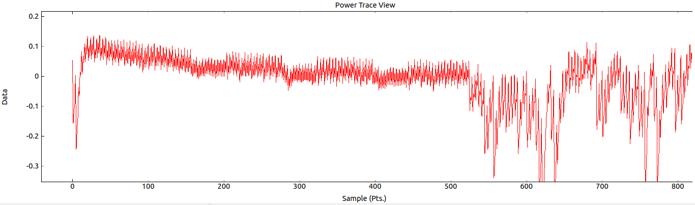
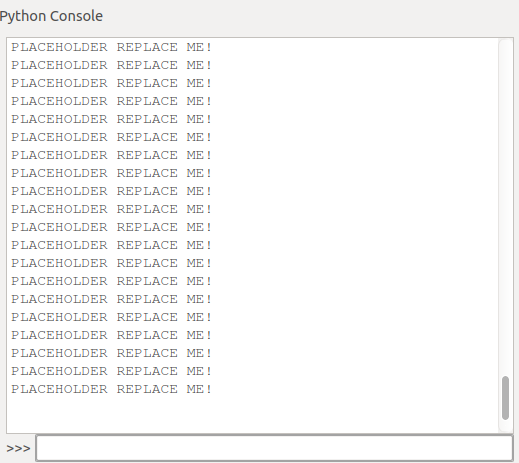
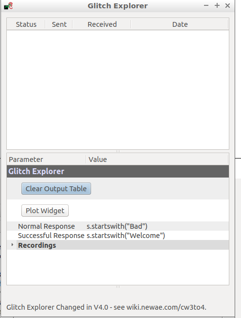

# ChipWhisperer lab return template 

Name ``` ```

Student id ``` ```

Participated in tasks ``` ```

...

Name ``` ```

Student id ``` ```

Participated in tasks ``` ```

Add all your group members names and student ids. If you continue the tasks at home you can work with different people. Please mark who participated in which tasks.

# Task 1
### Inspecting power differences of operations

Replace the following 3 screenshots. First screenshot should contain a picture of a power trace where you are executing nothing but 30 lines of of asm mul.
Second should contain a screenshot of a power trace where you execute nothing but 30 lines of asm nop.
Third should contain a power trace where you execute any amount of nops or muls. You need to execute atleast 10 lines worth of each command and in total atleast 40 lines worth of assembly code. You are not required to execute the commands in 10 line chuncks and you are allowed to execute other assembly commands besides nop and mul.  

Please have your screenshots roughly in the same scale as the placeholders. If your whole trace doesn't fit to that scale then you are allowed to take a larger picture.
X: ~800-1000 samples Y: ~0,3- -0,3

#### Three blocks of asm mul operations

#### Three blocks of asm nop operation

#### Trace with ?????


*Explain what is happening and where*

```
Paste the code you used here. You only need to paste the asm volatile() blocks
```

### Breaking AES

Explain shortly how the correlation power analysis works.
*insert explanation here*

*Insert picture of the Output vs Point plot tab below*


# Task 2

### Password bypass with power analysis

```
Paste PASSWORD_BYPASS.py here
```



### Breaking RSA

Paste screenshot of the Difference plot here


__Where did you take the reference sample and why?__

```

```

__What values did you use in the attack script?__
```

```
```
Paste attack script here
```
Can your program solve key ABE3 for corresponding trace? If not, tell why it does not work. How you could fix that?

```

```

# Task 3
##Glitch
**Paste the screenshot from step 7 here**


**Paste the screenshot from step 13 here**


**Paste the screenshot from step 17 here**



**Paste the screenshot of Glitch Explorer showing succesful password glitch**


```python
Paste your script that modfies the glitch parameters
```
```python
Paste your setup script
```
**Paste your Glitch Explorer logs to logs folder**


# Task 4

This tasks documentation varies depending on which versio you chose. Create your own documentation as you see fit. List here all the files that are part of your return
