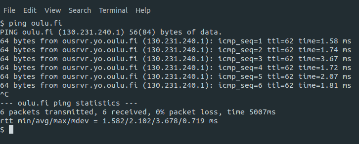

# This is an example template for returning lab exercises

**You will not need this, if you are showing *all* your results in the lab. This template is used, when you are returning files for returning box.**

Markdown syntax is preferred method for returning your exercise work.
You can include images (screenshots) and formatted source code in addition of *normal text*. This template showcases example implementation, and shows all needed syntax requirements.

This example is focusing on showcasing, how you can present images, text and source codes shortly. ***What you actually have to include in tasks, is described in actual task description.*** 

Open this file as raw source file, instead of Markdown preview, to be able see all correct syntax.

It is not necessary to reference images or code snippets in text, but it helps to review assigments.

### Images
You can place all images to 'images' folder. Then reference there like in examples Task 1 and Task 2 here.

### Sources
If you want to place pure source codes for tasks, you can put them to 'src' folder, and reference straight to file like [this.](src/hello.py)

syntax:
```
[this.](src/hello.py)
```


You can put whole source there, and then additionally give snippets here if needed like this: 

```python
def main():
  print 'Hello, world!'
if __name__ == '__main__':
  main()
```
Example syntax:
<pre lang="no-highlight"><code>
```python
def main():
  print 'Hello, world!'
if __name__ == '__main__':
  main()
```
</code></pre>


Syntax tags you might need: **python, c, shell, arm(for assembly)** 

**Actual example starts here:**


# Lab Exercise X: Tutorial assigment

**Student name:**

**Student number:**

**Student email address:**


## Task 1
What I did, how I did and why I did. 

*I am adding now example image from local folder to my work.*


Syntax:
```

```
Image:


## Task 2
What, how and why again.

If you want to resize your image, you have to use HTML syntax:

Syntax:
```


```
Images:


You can add images from external sources as well: 
```

```


## Task 3
This is how you print 'Hello, world!' in C - language.


```c
#include <stdio.h>
int main()
{
   // printf() displays the string inside quotation
   printf("Hello, World!");
   return 0;
}
```

## Task 4
You can use tables here:
```
What|Why|How
-|-|-
This|is|why
1|2|3
```


What|Why|How
-|-|-
This|is|why
1|2|3
